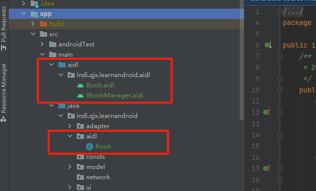
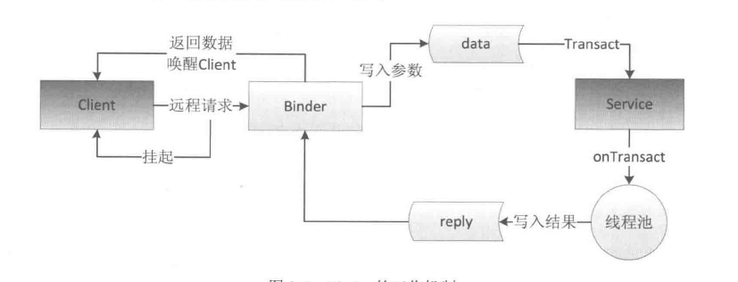

#跨进程通信IPC

##Android创建多进程的方式
在 Android 中使用多进程只有一种方法，那就是给四大组件(Activity、Service、Receiver、ContentProvider)在 AndroidMenifest 中指定 android;process属性，除此之外没有其他办法，也就是说我们无法给一个线程或者一个实体类指定其运行时所在的进程。其实还有另一种非常规的多进程方法，那就是通过JNI在 native 层去 fork一个新的进程，但是这种方法属于特殊情况，也不是常用的创建多进程的方式。

        <activity
            android:name=".ui.activity.IPCSecondActivity"
            android:exported="true"
            android:process=":remote"/>

一般来说，使用多进程会造成如下几方面的问题:

(1)静态成员和单例模式完全失效。

(2)线程同步机制完全失效。

(3)SharedPreferences 的可靠性下降

(4)Application会多次创建。

既然都不是一块内存了，那么不管是静态成员、锁对象还是锁全局类都无法保证线程同步，因为不同进程锁的不是同一个对象。第3个问题是因为 SharedPreferences不支持两个进程同时去执行写操作否则会导致一定几率的数据丢失，这是因为 SharedPreferences 底层是通过读/写XML文件来实现的，并发写显然是可能出问题的，甚至并发读/写都有可能出问题。第 4个问题也是显而易见的，当一个组件跑在一个新的进程中的时候，由于系统要在创建新的进程同时分配独立的虚拟机，所以这个过程其实就是启动一个应用的过程。因此，相当于系统又把这个应用重新启动了一遍，既然重新启动了，那么自然会创建新的 Application。

##IPC基础概念

###序列化
Serializable 和 Parcelable 接口可以完成对象的序列化过程，当我们需要通过Intent 和Binder 传输数据时就需要使用 Parcelable 或者 Serializable。还有的时候我们需要把对象持久化到存储设备上或者通过网络传输给其他客户端，这个时候也需要使用Serializable来完成对象的持久化。

Serializable是Java中的序列化接口其使用起来简单但是开销很大序列化和反序列化过程需要大量I/O操作。而 Parcelable 是Android 中的序列化方式，因此更适合用在 Android 平台上，它的缺点就是使用起来稍微麻烦点，但是它的效率很高，这是Android 推荐的序列化方式，因此我们要首选 Parcelable。Parcelable 主要用在内存序列化上，通过 Parcelable 将对象序列化到存储设备中或者将对象列化后通过网络传输也都是可以的，但是这个过程会稍显复杂，因此在这两种情况下建议大家使用 Serializable。以上就是 Parcelable和Serializable 的区别。

###Binder
直观来说，Binder是Android 中的一个类，它实现了IBinder 接口。从IPC角度来说Binder 是 Android 中的一种跨进程通信方式，Binder 还可以理解为一种虚拟的物理设备它的设备驱动是/dev/binder,该通信方式在 Linux 中没有;从Android Framework 角度来说,Binder 是 ServiceManager连接各种Manager(ActivityManager、WindowManager，等等)和相应ManagerService 的桥梁;从Android 应用层来说，Binder 是客户端和服务端进行通信的媒介，当bindService 的时候，服务端会返回一个包含了服务端业务调用的 Binder 对象，通过这个 Binder 对象，客户端就可以获取服务端提供的服务或者数据，这里的服务包括普通服务和基于AIDL的服务。

上面三个文件中，Book,java 是一个表示图书信息的类，它实现了 Parcelable 接口。Book.aidl是 Book 类在 AIDL 中的声明。IBookManager.aidl 是我们定义的一个接口，里面有两个方法:getBookList和addBook，其中getBookList 用于从远程服务端获取图书列表，而addBook 用于往图书列表中添加一本书，当然这两个方法主要是示例用，不一定要有实际意义。我们可以看到，尽管 Book 类已经和 IBookManager 位于相同的包中，但是在IBookManager 中仍然要导入 Book 类，这就是AIDL的特殊之处。下面我们先看一下系统为IBookManager.aidl生产的 Binder 类，在app\build\generated\aidl_source_output_dir\debug\out 目录下中有一个IBookManagerjava的类，这就是我们要找的类，接下来我们需要根据这个系统生成的 Binder类来分析 Binder 的工作原理。这个接口的核心实现就是它的内部类Stub和 Stub 的内部代理类 Proxy，下面详细介绍针对这两个类的每个方法的含义。

####DESCRIPTOR

Binder 的唯一标识，一般用当前 Binder 的类名表示，比如本例中的"indi.qjx.learnandroid.common.adapter.aidl.IBookManager"。

####asInterface(android.os.IBinder obj)
用于将服务端的 Binder对象转换成客户端所需的AIDL接口类型的对象，这种转换过程是区分进程的,如果客户端和服务端位于同一进程，那么此方法返回的就是服务端的 Stub对象本身，否则返回的是系统封装后的 Stub.proxy 对象。

####asBinder
此方法用于返回当前 Binder 对象。

####onTransact
这个方法运行在服务端中的 Binder 线程池中，当客户端发起跨进程请求时，远程请求会通过系统底层封装后交由此方法来处理。该方法的原型为 `public Boolean onTransact (int code,android.os.Parcel data,android.os.Parcel reply,int flags)`。
服务端通过 code 可以确定客端所请求的目标方法是什么，接着从 data 中取出目标方法所需的参数(如果目标方法有参数的话)，然后执行目标方法。当目标方法执行完毕后，就向 reply 中写入返回值(如果目标方法有返回值的话)，onTransact 方法的执行过程就是这样的。需要注意的是，如果此方法返回 false，那么客户端的请求会失败，因此我们可以利用这个特性来做权限验证，毕竞我们也不希望随便一个进程都能远程调用我们的服务。
####Proxy#getBookList
这个方法运行在客户端，当客户端远程调用此方法时，它的内部实现是这样的:首先创建该方法所需要的输入型 Parcel对象 data输出型 Parcel对象 reply 和返回值对象 List;然后把该方法的参数信息写入 data 中(如果有参数的话);接着调用 transact 方法来发起RPC(远程过程调用)请求，同时当前线程挂起;然后服务端的 onTransact 方法会被调用，直到 RPC过程返回后，当前线程继续执行，并从 reply 中取出 RPC过程的返回结果;最后返回_reply 中的数据。
####Proxy#addBook
这个方法运行在客户端，它的执行过程和 getBookList 是一样的，addBook 没有返回值，所以它不需要从_reply 中取出返回值。

通过上面的分析，读者应该已经了解了 Binder 的工作机制，但是有两点还是需要额外说明一下:首先，当客户端发起远程请求时，由于当前线程会被挂起直至服务端进程返回数据，所以如果一个远程方法是很耗时的，那么不能在UI线程中发起此远程请求;其次由于服务端的 Binder 方法运行在 Binder 的线程池中，所以Binder 方法不管是否耗时都应该采用同步的方式去实现，因为它已经运行在一个线程中了。为了更好地说明 Binder，下面给出一个Binder 的工作机制图。

接下来，我们介绍 Binder 的两个很重要的方法 linkToDeath 和unlinkToDeath。我们知道，Binder 运行在服务端进程，如果服务端进程由于某种原因异常终止，这个时候我们到服务端的 Binder 连接断裂(称之为 Bider 死亡)，会导致我们的远程调用失败。更为关键的是，如果我们不知道 Binder 连接已经断裂，那么客户端的功能就会受到影响。为了解决这个问题,Binder 中提供了两个配对的方法linkToDeath和unlinkToDeath,通过linkToDeath我们可以给 Binder 设置一个死亡代理，当Binder 死亡时，我们就会收到通知，这个时候我们就可以重新发起连接请求从而恢复连接。那么到底如何给 Binder 设置死亡代理呢?也很简单。

首先，声明一个DeathRecipient对象。DeathRecipient是一个接口，其内部只有一个方法 binderDied，我们需要实现这个方法，当 Binder 死亡的时候，系统就会回调 binderDied方法，然后我们就可以移出之前绑定的 binder 代理并重新绑定远程服务:

    private IBinder.DeathRecipient mDeathRecipient = new IBinder.DeathRecipient() {
        @Override
        public void binderDied() {
            Log.d(TAG, "binder died. tname:" + Thread.currentThread().getName());
            if (mRemoteBookManager == null)
                return;
            mRemoteBookManager.asBinder().unlinkToDeath(mDeathRecipient, 0);
            mRemoteBookManager = null;
            // TODO:这里重新绑定远程Service
        }
    };

在客户端绑定远程服务成功后，给binder设置死亡代理：

    IBookManager bookManager = IBookManager.Stub.asInterface(service);
    mRemoteBookManager.asBinder().linkToDeath(mDeathRecipient, 0);

##IPC方式
###使用Bundle

我们知道，四大组件中的三大组件 (Activity、Service、Receiver)都是支持在Intent中传递Bundle数据的，由于 Bundle 实现了Parcelable 接口，所以它可以方便地在不同的进程间传输。基于这一点，当我们在一个进程中启动了另一个进程的 Activity、Service 和Receiver，我们就可以在 Bundle 中附加我们需要传输给远程进程的信息并通过 Intent 发送出去。当然，我们传输的数据必须能够被序列化，比如基本类型、实现了 Parcellable 接口的对象、实现了 Serializable 接口的对象以及一些Android 支持的特殊对象，具体内容可以看Bundle这个类，就可以看到所有它支持的类型。Bundle不支持的类型我们无法通过它在进程间传递数据，这是一种最简单的进程间通信方式，

###使用文件共享
两个进程通过读/写同一个文件来交换数据，比如 A 进程把数据写入文件，B 进程通过读取这个文件来获取数据。我们知道，在Windows 上，一个文件如果被加了排斥锁将会导致其他线程无法对其进行访问，包括读和写，而由于 Android 系统基于 Linux，使得其并发读/写文件可以没有限制地进行，甚至两个线程同时对同一个文件进行写操作都是允许的，尽管这可能出问题。通过文件交换数据很好使用，除了可以交换一些文本信息外，我们还可以序列化一个对象到文件系统中的同时从另一个进程中恢复这个对象。

通过文件共享这种方式来共享数据对文件格式是没有具体要求的，比如可以是文本文件，也可以是 XML 文件，只要读/写双方约定数据格式即可。通过文件共享的方式也是有局限性的，比如并发读/写的问题，像上面的那个例子，如果并发读/写，那么我们读出的内容就有可能不是最新的，如果是并发写的话那就更严重了。因此我们要尽量避免并发写这种情况的发生或者考虑使用线程同步来限制多个线程的写操作。通过上面的分析，我们可以知道，文件共享方式适合在对数据同步要求不高的进程之间进行通信，并且要妥善处理并发读/写的问题。

当然，SharedPreferences 是个特例，众所周知，SharedPreferences 是Android 中提供的轻量级存储方案，它通过键值对的方式来存储数据，在底层实现上它采用 XML 文件来存储键值对，每个应用的SharedPreferences 文件都可以在当前包所在的 data 目录下查看到。一般来说，它的目录位于/data/data/package name/shared prefs 目录下，其中 package name表示的是当前应用的包名。从本质上来说，SharedPreferences 也属于文件的一种，但是由于系统对它的读/写有一定的缓存策略即在内存中会有一份SharedPreferences 文件的缓存因此在多进程模式下，系统对它的读/写就变得不可靠，当面对高并发的读/写访问，Sharedpreferences 有很大几率会丢失数据，因此，不建议在进程间通信中使用SharedPreferences 。