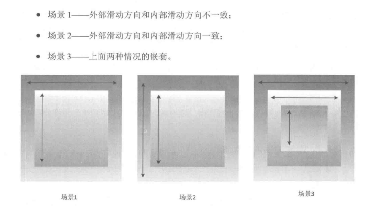

# View相关

## View基础知识

### View的位置参数

View 的位置主要由它的四个顶点来决定,分别对应于 View 的四个属性:top，left，right，bottom，其中top是左上角纵标，left 是左上角横标，right 是右下角横标，bottom是右下角纵坐标。需要注意的是，这些坐标都是相对于 View 的父容器来说的，因此它是一种相对坐标。

    width = right-left
    height = bottom - top

在View的源码中它们对应于mLeft、mRight、mTop和mBottom这四个成员变量，获取方式如下所示

    Left = getLeft();
    Right=getRight();
    Top= getTop();
    Bottom =getBottom()

从Android3.0开始，View 增加了额外的几个参数:x、y、translationX和translationY其中x和y是View左上角的坐标，而translationX和translationY 是 View左上角相对于父容器的偏移量。这几个参数也是相对于父容器的坐标，并且translationX和translationY的默认值是0，和 View 的四个基本的位置参数一样，View 也为它们提供了 get/set 方法，这几个参数的换算关系如下所示。

    x = left + translationX
    y = top + translationY

需要注意的是，View 在平移的过程中，top 和 left 表示的是原始左上角的位置信息其值并不会发生改变，此时发生改变的是x、y、translationX和translationY 这四个参数

### 基础概念

#### MotionEvent

在手指接触屏幕后所产生的一系列事件中，典型的事件类型有如下几种

- ACTION_DOWN--手指刚接触屏幕:
- ACTION_MOVE-手指在屏幕上移动:
- ACTION_UP-手机从屏幕上松开的一瞬间

正常情况下，一次手指触摸屏幕的行为会触发一系列点击事件，考虑如下几种情况:

点击屏幕后离开松开，事件序列为 DOWN->UP;

点击屏幕滑动一会再松开，事件序列为 DOWN->MOVE->...MOVE->UP

上述三种情况是典型的事件序列，同时通过 MotionEvent 对象我们可以得到点击事件发生的x和y坐标。为此，系统提供了两组方法:getX/getY 和getRawX/getRawY。它们的区别其实很简单，getX/getY 返回的是相对于当前 Vew 左上角的x和y标，而getRawX/getRawY返回的是相对于手机屏幕左上角的x和y坐标。

#### TouchSlop 
 
TouchSlop是系统所能识别出的被认为是滑动的最小距离，换句话说，当手指在屏幕上滑动时，如果两次滑动之间的距离小于这个常量，那么系统就不认为你是在进行滑动操作。原因很简单:滑动的距离太短，系统不认为它是滑动。这是一个常量，和设备有关，在不同设备上这个值可能是不同的，通过如下方式即可获取这个常量:ViewConfiguration.get(getContext()).getScaledTouchSlop()。当我们在处理滑动时，可以利用这个常量来做一些过滤，比如当两次滑动事件的滑动距离小于这个值，我们就可以认为未达到滑动距离的临界值，因此就可以认为它们不是滑动，这样做可以有更好的用户体验。

#### VelocityTracker

速度追踪，用于追踪手指在滑动过程中的速度，包括水平和竖直方向的速度。它的使用过程很简单，首先，在View的onTouchEvent 方法中追踪当前单击事件的速度:
    
    VelocityTracker velocityTracker = VelocityTracker.obtain();
    velocityTracker.addMovement(event);

接着，当我们先知道当前的滑动速度时，这个时候可以采用如下方式来获得当前的速度:

    velocityTracker.computeCurrentVelocity(1000);
    int xVelocity=(int)velocityTracker.getXVelocity()
    int yVelocity=(int) velocityTracker.getYVelocity();

在这一步中有两点需要注意，第一点，获取速度之前必须先计算速度，即getXVelocity和getYVelocity这两个方法的前面必须要调用computeCurrentVelocity 方法;第二点速度可以为负数，手指逆着坐标系的正方向滑动，所产生的速度就为负值。另外，computeCurrentVelocity 这个方法的参数表示的是一个时间单元或者说时间间隔，它的单位是毫秒(ms，计算速度时得到的速度就是在这个时间间隔内手指在水平或竖直方向上所滑动的像素数。针对上面的例子，如果我们通过velocityTracker.computeCurrentVelocity(100)来获取速度，那么得到的速度就是手指在100ms内所滑过的像素数，因此水平速度就成了 10像素/每100ms(这里假设滑动过程是匀速的)，最后，当不需要使用它的时候，需要调用 clear 方法来重置并回收内存:

    velocityTracker.clear();
    velocityTracker.recycle();


#### GestureDetector

手势检测，用于辅助检测用户的单击、滑动、长按、双击等行为。要使用 GestureDetector也不复杂，参考如下过程。
首先，需要创建一个GestureDetector对象并实现OnGestureListener 接口，根据需要我们还可以实现OnDoubleTapListener 从而能够监听双击行为:

    GestureDetector mGestureDetector = new GestureDetector(this);
	//解决长按屏幕后无法拖动的现象
    mGestureDetector.setIsLongpressEnabled(false);

接着，接管目标 View 的onTouchEvent 方法，在待监听 View 的onTouchEvent 方法中添加如下实现:

    boolean consume= mGestureDetector.onTouchEvent(event);
    return consume;

OnGestureListener中，比较常用的有:onSingleTapUp(单击)、 onFling(快速滑动)、onScroll(拖动)、onLongPress(长按)和onDoubleTap (双击)。另外这里要说明的是，实际开发中，可以不使用GestureDetector，完全可以自己在 View的onTouchEvent 方法中实现所需的监听，这个就看个人的喜好了。这里有一个建议供读者参考:如果只是监听滑动相关的，建议自己在onTouchEvent中实现，如果要监听双击这种行为的话，那么就使用GestureDetector。

#### Scroller

弹性滑动对象用于实现View的弹性滑动。我们知道当使用 View的scrollTo/scrollBy方法来进行滑动时，其过程是瞬间完成的，这个没有过渡效果的滑动用户体验不好。这个时候就可以使用 Scroller 来实现有过渡效果的滑动，其过程不是瞬间完成的，而是在一定的时间间隔内完成的。Scroller 本身无法让 View 弹性滑动，它需要和 View的computeScroll方法配合使用才能共同完成这个功能。

    Scroller scroller =new Scroller(mContext);
    //缓慢滚动到指定位置
    private void smoothscrollTo(int destX，int destY){
	    int scrollX=getScrollX();
	    int delta=destx-scrollX;
	    //1000ms内滑向destx，效果就是慢慢滑动
	    mScroller.startscroll(scrollx，0，delta，0，1000);
		invalidate();
	}

    @Override
    public void computeScroll() {
    	if (mScroller.computescrollOffset()){
			scrollTo(mScroller.getCurrX()，mScroller.getCurrY());
			postInvalidate(); 
		}
	}


### View的滑动

通过三种方式可以实现View的滑动:第一种是通过View本身提供的scrollTo/scrollBy方法来实现滑动;第二种是通过动画给 View施加平移效果来实现滑动:第三种是通过改变View的 LayoutParams 使得 View 重新布局从而实现滑动。

#### scrollTo/scrollBy

在滑动过程中mScrollX 的值总是等于 View左边缘和View内容左边缘在水平方向的距离而mScrollY的值总是等于View上边缘和View内容上边缘在坚直方向的距离。View 边缘是指 Vew 的位置，由四个顶点组成，而 View 内容边缘是指View中的内容的边缘，scrollTo和scrollBy 只能改变View 内容的位置而不能改变View在布局中的位置。mScrollX和mScrollY 的单位为像素，mScrollX为正值，View 内容向左移动，mScrollX为负值，View 内容向右移动；
mScrolly为正值，View 内容向上移动，mScrollX为负值，View 内容向下移动。

#### 动画

View动画是对 View 的影像做操作，它并不能真正改变View的位置参数包括宽/高,并且如果希望动画后的状态得以保留还必须将fillAfter属性设置为 true，否则动画完成后其动画结果会消失。比如我们要把 View 向右移动 100像素，如果fllAfter 为 false，那么在动画完成的一刹那，View 会瞬间恢复到动画前的状态:如果fllAfter 为true，在动画完成后，View 停留在距原始位置 100 像素的右边。使用属性动画并不会存在上述问题，但是在 Android 3.0以下无法使用属性动画，这个时候我们可以使用动画兼容库 nineoldandroids 来实现属性动画，尽管如此，在Android 3.0以下的手机通过nineoldandroids来实现的属性动画本质上仍然是View动画。

#### LayoutParams
    
    MarginLayoutParams params = (MarginLayoutParams)mButtonl,getlayoutParams();
    params.width +=100;
    params.leftMargin +=100;
    mButton1 requestlayout();
    //或者mButton1.setLayoutParams(params);

## View事件分发

    public boolean dispatchTouchEvent(MotionEvent ev)

用来进行事件的分发。如果事件能够传递给当前 View，那么此方法一定会被调用，返回结果受当前 View的onTouchEvent 和下级 View的dispatchTouchEvent方法的影响，表示是否消耗当前事件。

    public boolean onInterceptTouchEvent(MotionEvent event)

在上述方法内部调用，用来判断是否拦截某个事件，如果当前 View 拦截了某个事件那么在同一个事件序列当中，此方法不会被再次调用，返回结果表示是否拦截当前事件。

    public boolean onTouchEvent(MotionEvent event)

在dispatchTouchEvent 方法中调用，用来处理点击事件，返回结果表示是否消耗当前事件，如果不消耗，则在同一个事件序列中，当前 View 无法再次接收到事件。

其实它们的关系可以用如下伪代码表示:

    public boolean dispatchTouchEvent(MotionEvent ev){
		boolean consume = false;
	    if (onInterceptTouchEvent(ev)) {
		    consume = onTouchEvent(ev);
		} else {
		    consume = child.dispatchTouchEvent(ev);
		}
	    return consume;
	}

对于一个根 ViewGroup 来说，点击事件产生后，首先会传递给它,这时它的 dispatchTouchEvent就会被调用,如果这个ViewGroup 的onInterceptTouchEvent方法返回true就表示它要拦截当前事件，接着事件就会交给这个 ViewGroup 处理，即它的onTouchEvent方法就会被调用;如果这个 ViewGroup 的onInterceptTouchEvent方法返回false就表示它不拦截当前事件，这时当前事件就会继续传递给它的子元素，接着子元素的dispatchTouchEvent 方法就会被调用，如此反复直到事件被最终处理。


当一个 View 需要处理事件时，如果它设置了 OnTouchListener，那么OnTouchListener中的onTouch 方法会被回调。这时事件如何处理还要看 onTouch 的返回值，如果返回false则当前 View的onTouchEvent 方法会被调用;如果返回 true，那么onTouchEvent 方法将不会被调用。由此可见，给 View 设置的 OnTouchListener，其优先级比onTouchEvent 要高。在onTouchEvent 方法中，如果当前设置的有 OnClickListener，那么它的 onClick 方法会被调用。可以看出，平时我们常用的 OnClickListener，其优先级最低，即处于事件传递的尾端。


当一个点击事件产生后，它的传递过程遵循如下顺序:Activity-> Window->View，即事件总是先传递给Activity，Activity再传递给 Window，最后 Window 再传递给顶级 View。顶级 View 接收到事件后，就会按照事件分发机制去分发事件。考虑一种情况，如果一个View的onTouchEvent返回false，那么它的父容器的onTouchEvent 将会被调用，依此类推如果所有的元素都不处理这个事件,那么这个事件将会最终传递给Activity处理，即Activity的onTouchEvent 方法会被调用。这个过程其实也很好理解，我们可以换一种思路，假如点击事件是一个难题，这个难题最终被上级领导分给了一个程序员去处理(这是事件分发过程)，结果这个程序员搞不定 (onTouchEvent 返回了 false)，现在该怎么办呢?难题必须要解决，那只能交给水平更高的上级解决(上级的onTouchEvent 被调用)，如果上级再搞不定，那只能交给上级的上级去解决，就这样将难题一层层地向上抛，这是公司内部一种很常见的处理问题的过程。从这个角度来看，View 的事件传递过程还是很贴近现实的，毕竞程序员也生活在现实中。

关于事件传递的机制，这里给出一些结论，根据这些结论可以更好地理解整个传递机制，如下所示。

(1)同一个事件序列是指从手指接触屏幕的那一刻起，到手指离开屏幕的那一刻结束，在这个过程中所产生的一系列事件，这个事件序列以 down 事件开始，中间含有数量不定的move 事件，最终以up 事件结束。

(2)正常情况下，一个事件序列只能被一个 View 拦截且消耗。这一条的原因可以参考(3)，因为一旦一个元素拦截了某此事件，那么同一个事件序列内的所有事件都会直接交给它处理，因此同一个事件序列中的事件不能分别由两个 View 同时处理，但是通过特殊手段可以做到，比如一个 View 将本该自已处理的事件通过onTouchEvent 强行传递给其他 View处理。

(3)某个 View 一旦决定拦截，那么这一个事件序列都只能由它来处理(如果事件序列能够传递给它的话)，并且它的 onInterceptTouchEvent 不会再被调用。这条也很好理解，就是说当一个 View 决定拦截一个事件后，那么系统会把同一个事件序列内的其他方法都直接交给它来处理，因此就不用再调用这个 View的onInterceptTouchEvent 去询问它是否要拦截了。

(4)某个 View 一旦开始处理事件,如果它不消耗ACTION_DOWN 事件(onTouchEvent返回了 false)，那么同一事件序列中的其他事件都不会再交给它来处理，并且事件将重新交由它的父元素去处理，即父元素的 onTouchEvent 会被调用。意思就是事件一旦交给一个View 处理，那么它就必须消耗掉，否则同一事件序列中剩下的事件就不再交给它来处理了这就好比上级交给程序员一件事，如果这件事没有处理好，短期内上级就不敢再把事情交给这个程序员做了，二者是类似的道理。

(5)如果 View 不消耗除 ACTION_DOWN 以外的其他事件那么这个点击事件会消失此时父元素的 onTouchEvent 并不会被调用，并且当前 View 可以持续收到后续的事件，最终这些消失的点击事件会传递给 Activity 处理。

(6)ViewGroup 默认不拦截任何事件。Android 源码中 ViewGroup 的 onInterceptTouch-Event方法默认返回false。

(7) View 没有 onInterceptTouchEvent 方法，一旦有点击事件传递给它，那么它的onTouchEvent 方法就会被调用。

(8)View的onTouchEvent默认都会消耗事件(返回true),除非它是不可点击的(clickable和longClickable 同时为 false)。View 的 longClickable 属性默认都为 false，clickable 属性要分情况,比如 Button 的clickable 属性默认为 true,而 TextView 的 clickable 属性默认为 false。

(9)View 的enable 属性不影响 onTouchEvent 的默认返回值。哪怕一个 View 是disable状态的，只要它的 clickable 或者 ongClickable 有一个为 true，那么它的 onTouchEvent 就返回true

(10) onClick 会发生的前提是当前 View 是可点击的，并且它收到了 down 和up 的事件。

(11)事件传递过程是由外向内的，即事件总是先传递给父元素，然后再由父元素分发给子 View，通过 requestDisallowInterceptTouchEvent 方法可以在子元素中干预父元素的事件分发过程，但是ACTION_DOWN 事件除外。

分析过程可以参考 [https://juejin.cn/post/7168445102984003591](https://juejin.cn/post/7168445102984003591)

## View滑动冲突



### 外部拦截法

所谓外部拦截法是指点击事情都先经过父容器的拦截处理，如果父容器需要此事件就拦截，如果不需要此事件就不拦截，这样就可以解决滑动冲突的问题，这种方法比较符合点击事件的分发机制。外部拦截法需要重写父容器的方法，在内部做相应的拦截即可。

### 内部拦截法
内部拦截法是指父容器不拦截任何事件，所有的事件都传递给子元素，如果子元素需要此事件就直接消耗掉，否则就交由父容器进行处理，这种方法和 Android 中的事件分发机制不一致，需要配合 requestDisallowInterceptTouchEvent 方法才能正常工作，使用起来较外部拦截法稍显复杂。

当子类不想让其父类/祖先ViewGroup.onInterceptTouchEvent(MotionEvent)方法执行时，可以调用requestDisallowInterceptTouchEvent()，一旦标记位被设置为true，后续事件序列中的所有事件都不会调用了父类的onInterceptTouchEvent了。

除了子元素需要做处理以外，父元素也要默认拦截除了 ACTION_DOWN 以外的其他事件，这样当子元素调用 parent.requestDisallowInterceptTouchEvent(false)方法时，父元素才能继续拦截所需的事件。为什么父容器不能拦截ACTION_DOWN 事件呢?那是因为ACTION_DOWN事件并不受FLAG_DISALLOW_INTERCEPT这个标记位的控制，所以一旦父容器拦截ACTION DOWN事件，那么所有的事件都无法传递到子元素中去，这样内部拦截就无法起作用了。

## View工作原理

### ViewRoot和DecorView

ViewRoot对应于ViewRootImpl 类，它是连接WindowManager和DecorView 的纽带。View 的三大流程均是通过ViewRoot 来完成的。在ActivityThread 中，当Activity 对象被创建完毕后，会将 DecorView 添加到 Window 中，同时会创建 ViewRootImpl 对象，并将ViewRootImpl对象和DecorView 建立关联。

View 的绘制流程是从 ViewRoot 的 performTraversals 方法开始的，它经过measure、layout和draw三个过程才能最终将一个 View绘制出来，其中measure 用来测量 View的宽和高,layout 用来确定 View 在父容器中的放置位置，而draw 则负责将 View 绘制在屏幕上。

performTraversals 会依次调用 performMeasure、performLayout 和performDraw三个方法，这三个方法分别完成顶级 View的measure、layout和draw这三大流程其中在performMeasure 中会调用measure方法在measure方法中又会调用onMeasure方法，在onMeasure 方法中则会对所有的子元素进行measure过程，这个时候measure流程就从父容器传递到子元素中了，这样就完成了一次 measure 过程。接着子元素会重复父容器的measure过程，如此反复就完成了整个 View 树的遍历。同理，performLayout和performDraw的传递流程和performMeasure 是类似的，唯一不同的是，performDraw的传递过程是在draw 方法中通过dispatchDraw 来实现的，不过这并没有本质区别。

measure过程决定了 View 的宽/高，Measure完成以后，可以通过getMeasuredWidth和getMeasuredHeight 方法来获取到 View 测量后的宽/高，在几乎所有的情况下它都等同于View 最终的宽/高，但是特殊情况除外，这点在本章后面会进行说明。Layout 过程决定了View 的四个顶点的坐标和实际的 View 的宽/高，完成以后，可以通过 getTop、getBottom、getLeft和getRight 来拿到 View 的四个顶点的位置，并可以通过 getWidth和getHeight方法来拿到View 的最终宽/高。Draw 过程则决定了 View 的显示只有draw 方法完成以后 View的内容才能呈现在屏幕上。

DecorView 作为顶级 View，一般情况下它内部会包含一个竖直方向的LinearLayout，在这个LinearLayout 里面有上下两个部分(具体情况和Android 版本及主题有关)，上面是标题栏，下面是内容栏。在Activity 中我们通过setContentView 所设置的布局文件其实就是被加到内容栏之中的，而内容栏的id是content，因此可以理解为 Activity指定布局的方法不叫setview而叫 setContentView,因为我们的布局的确加到了id为content的 FrameLayout 中。如何得到 content 呢?可以这样: ViewGroup content= findViewByld(R.android.id.content)。如何得到我们设置的 View 呢?可以这样:content.getChildAt(0)。同时，通过源码我们可以知道，DecorView 其实是一个FrameLavout，View 层的事件都先经过DecorView，然后才传递给我们的View。


### MeasureSpec

MeasureSpec代表一个32位int 值，高2位代表SpecMode，低30位代表 SpecSize,SpecMode 是指测量模式，而 SpecSize 是指在某种测量模式下的规格大小。

MeasureSpec 通过将SpecMode和SpecSize打包成一个int值来避免过多的对象内存分配，为了方便操作，其提供了打包和解包方法。SpecMode 和 SpecSize 也是一个int值，组SpecMode 和SpecSize可以打包为一个MeasureSpec,而一个MeasureSpec 可以通过解包的形式来得出其原始的 SpecMode 和 SpecSize,需要注意的是这里提到的 MeasureSpec 是指MeasureSpec所代表的int值，而并非MeasureSpec本身。

SpecMode 有三类，每一类都表示特殊的含义，如下所示。

**UNSPECIFIED**

父容器不对 View 有任何限制，要多大给多大，这种情况一般用于系统内部，表示一种测量的状态。

**EXACTLY**

父容器已经检测出View所需要的精确大小，这个时候View的最终大小就是SpecSize所指定的值。它对应于LayoutParams中的match_parent和具体的数值这两种模式

**AT MOST**

父容器指定了一个可用大小即 SpecSize， View 的大小不能大于这个值，具体是什么值要看不同View的具体实现。它对应于LayoutParams中的wrap_content。


### MeasureSpec和LayoutParams 的对应关系

在 View测量的时候，系统会将 LayoutParams 在父容器的约束下转换成对应的 MeasureSpec，然后再根据这个MeasureSpec 来确定 View 测量后的宽/高。需要注意的是，MeasureSpec 不是唯由LayoutParams决定的,LayoutParams需要和父容器一起才能决定View的MeasureSpec。另外，对于顶级 View(即 DecorView)和普通 View 来说,MeasureSpec 的转换过程略有不同。对于 DecorView，其 MeasureSpec 由窗口的尺寸和其自身的LayoutParams来共同确定;对于普通 View，其MeasureSpec 由父容器的MeasureSpec和自身的LayoutParams来共同决定，MeasureSpec 一旦确定后， onMeasure中就可以确定View的测量宽/高。

当DecorView的LayoutParams是match_parent时，测量模式是EXACTLY，值是Window大小；当DecorView的LayoutParams是wrap_content时,测量模式是AT_MOST，值是window大小。

| 子View布局\父View Mode | EXACTLY | AT_MOST | UNSPECIFIE |
| ------ | ----------- | ----------- | ----------- |
| Ddp/dx具体值 | EXACTLY+childSize | EXACTLY+childSize | EXACTLY+childSize |
| match_parent | EXACTLY+parentSize | AT_MOST+parentSize | UNSPECIFIIED+0 |
| wrap_conent | AT_MOST+parentSize | AT_MOST+parentSize | UNSPECIFIIED+0 |


### View的工作流程

View的工作流程主要是指measure、layout、draw这三大流程，即测量、布局和绘制，其中measure确定View的测量宽高，layout确定View的最终宽高和四个顶点的位置，而draw则将View绘制到屏幕上。

#### measure过程
measure过程要分情况来看，如果只是一个原始的View，那么通过measure方法就完成了其测量过程，如果是一个ViewGroup，出了完成自己的测量过程外，还会遍历去调用所有的子元素的measure方法，各个子元素再递归去执行这个流程，下面针对这两种情况分别讨论。

##### View的measure过程

View的measure过程由其measure方法来完成，measure方法是一个final类型的方法，这意味着子类不能重写此方法，在View的onMeasure方法，因此只需要看onMeasure的实现即可，View的onMeasure方法如下所示。
```
    protected void onMeasure(int widthMeasureSpec, int heightMeasureSpec) {
        setMeasuredDimension(getDefaultSize(getSuggestedMinimumWidth(), widthMeasureSpec),
                getDefaultSize(getSuggestedMinimumHeight(), heightMeasureSpec));
    }
```

上述代码很简洁，但是简洁并不代表简单，setMeasuredDimension方法会设置View宽高的测量值，因此我们只需要看getDefaultSize这个方法即可：
```
    public static int getDefaultSize(int size, int measureSpec) {
        int result = size;
        int specMode = MeasureSpec.getMode(measureSpec);
        int specSize = MeasureSpec.getSize(measureSpec);
        switch (specMode) {
        case MeasureSpec.UNSPECIFIED:
            result = size;
            break;
        case MeasureSpec.AT_MOST:
        case MeasureSpec.EXACTLY:
            result = specSize;
            break;
        }
        return result;
    }
```


可以看出，getDefaultSize这个方法的逻辑很简单，对于我们来说，我们只需要看AT_MOST和EXACTLY这两种情况。简单地理解，其实getDefaultSize返回的大小就是measureSpec中的specSize，而这个 specSize就是View测量后的大小，这里多次提到测量后的大小，是因为View最终的大小是在layout阶段确定，所以这里必须要加以区分，但是几乎所有情况下View的测量大小和最终大小是相等的。
至于UNSPECIFIED这种情况，一般用于系统内部的测量过程，在这种情况下，View的大小为getDefaultSize的第一个参数size，即宽高分别为getSuggestedMinimumWidth和 getSuggestedMinimumHeight这两个方法的返回值，看一下它们的源码：

```
    protected int getSuggestedMinimumHeight() {
        return (mBackground == null) ? mMinHeight : max(mMinHeight, mBackground.getMinimumHeight());
 
    }
 
    protected int getSuggestedMinimumWidth() {
        return (mBackground == null) ? mMinWidth : max(mMinWidth, mBackground.getMinimumWidth());
    }
```

这里只分析 getSuggestedMinimumWidth方法的实现， getSuggestedMinimumHeight和它实现原理是一样的。getSuggestedMinimumWidth的代码可以看出，如果View没有设置背景，那么View的宽度为mMinWidth，而mMinWidth对应于android:minWidth这个属性所指的值，因此View的宽度即为android:minWidth属性所指定的值。这个属性如果不指定，那么mMinWidth则默认为0；如果View指定了背景，则View的宽度为max(mMinWidth,mBackground.getMinimumWidth())。mMinWidth的含义我们已经知道了，那么mBackground.getMinimumWidth()是什么呢？我们看一下Drawable的getMinimunWidth方法，如下所示。
```
    public int getMinimumWidth() {
        final int intrinsicWidth = getIntrinsicWidth();
        return intrinsicWidth > 0 ? intrinsicWidth : 0;
    }
```
可以看出， getMinimumWidth()返回的就是Drawable的原始宽度，前提是这个 Drawable有原始宽度，否则就返回0。那么Drawable在什么情况下有原始宽度呢？这里先举个例子说明一下，ShapeDrawable无原始宽高，而BitmapDrawable有原始宽高(图片的尺寸)，详细内容会在后续章节进行介绍。
这里再总结一下 getSuggestedMinimumWidth的逻辑：如果View没有设置背景，那么返回android:minWidth这个属性所指定的值，这个值可以为0；如果View设置了背景，则返回 android:minWidth和背景的最小宽度这两种中的最大值， getSuggestedMinimumWidth和 getSuggestedMinimumHeight的返回值就是View再UNSPECIFIED情况下的测量宽高。
从getDefaultSize方法的实现来看，View的宽高由specSize决定，所以我们可以得出如下结论：直接继承View的自定义控件需要重写onMeasure方法并设置wrap_content时的自身大小，否则再布局中使用wrap_content就相当于使用match_parent。为什么呢？这个原因需要结合上述代码和上表才能更好地理解。从上述代码中我们知道，如果View在布局中使用wrap_content，那么它的specMode是AT_MOST模式，在这种模式下，它的宽高等于specSize；查看上表可以知道，这种情况下View的specSize是parentSize，而parentSize是父容器中目前可以使用的带线啊哦，也就是父容器当前剩余的控件大小。很显然，View的宽高就等于父容器当前剩余的控件大小，这种效果和在布局中使用match_parent完全一致。如何解决这个问题呢？也很简单，如下所示。
```
    @Override
    protected void onMeasure(int widthMeasureSpec, int heightMeasureSpec) {
        super.onMeasure(widthMeasureSpec, heightMeasureSpec);
        int widthSpecMode = MeasureSpec.getMode(widthMeasureSpec);
        int widthSpecSize = MeasureSpec.getSize(widthMeasureSpec);
        int heightSpecMode = MeasureSpec.getMode(heightMeasureSpec);
        int heightSpecSize = MeasureSpec.getSize(heightMeasureSpec);
        if (widthSpecMode == MeasureSpec.AT_MOST && heightSpecMode == MeasureSpec.AT_MOST){
            setMeasuredDimension(mWidth,mHeight);
        } else if (widthSpecMode == MeasureSpec.AT_MOST) {
            setMeasuredDimension(mWidth,heightSpecSize);
        }  else if (heightSpecMode == MeasureSpec.AT_MOST) {
            setMeasuredDimension(widthSpecSize,mHeight);
        }
    }
```

在上面的代码中，我们只需要给View指定一个默认的内部跨高(mWidth和mHeight)，并在wrap_content时设置此宽高即可。对于非wrap_content情形，我们沿用系统的测量值即可，至于这个默认的内部宽高的大小如何指定，这个没有固定的依据，根基需要灵活指定即可。如果查看TextView、ImageView等源码就可以知道，针对wrap_content情形，它们的onMeasure方法均做了特殊处理，读者可以自行查看它们的源码。

##### ViewGroup的measure过程
对于ViewGroup来说，除了完成自己的measure过程外，还会遍历去调用所有子元素的measure方法，各个子元素再递归去执行这个过程。和View不同的是，ViewGroup是一个抽象类，因此它没有重写View的onMeasure方法，但它提供了一个角measureChildren的方法，如下所示。
```
    protected void measureChildren(int widthMeasureSpec, int heightMeasureSpec) {
        final int size = mChildrenCount;
        final View[] children = mChildren;
        for (int i = 0; i < size; ++i) {
            final View child = children[i];
            if ((child.mViewFlags & VISIBILITY_MASK) != GONE) {
                measureChild(child, widthMeasureSpec, heightMeasureSpec);
            }
        }
    }
```
从上述代码来看，ViewGroup在measure时，会对每一个子元素进行measure，measureChild这个方法的实现也很好理解，如下所示。
```
    protected void measureChild(View child, int parentWidthMeasureSpec,
            int parentHeightMeasureSpec) {
        final LayoutParams lp = child.getLayoutParams();
 
        final int childWidthMeasureSpec = getChildMeasureSpec(parentWidthMeasureSpec,
                mPaddingLeft + mPaddingRight, lp.width);
        final int childHeightMeasureSpec = getChildMeasureSpec(parentHeightMeasureSpec,
                mPaddingTop + mPaddingBottom, lp.height);
 
        child.measure(childWidthMeasureSpec, childHeightMeasureSpec);
    }
```
很显然，measureChild的思想就是取出子元素的LayoutParams，然后通过getChildMeasureSpec来创建子元素的MeasureSpec，接着将 MeasureSpec直接传递给View的measure方法来进行测量。 getChildMeasureSpec的工作过程已经在上面进行了详细分析，通过上表可以更清晰地了解它地逻辑。
我们知道，ViewGroup并没有定义其测量地具体过程，这是因为ViewGroup是一个抽象类，其测量过程地onMeasure方法需要各个子类去具体实现，比如LinearLayout、RelativeLayout等，为什么ViewGroup不像View一样对其onMeasure方法做统一的实现呢？那是因为不同的ViewGroup子类有不同的布局特性，这导致它们的测量细节各不相同，比如LinearLayout和RelativeLayout这两者的布局特性显然不同，因此ViewGroup无法做统一实现。下面就通过LinearLayout的onMeasure方法来分析ViewGroup的Measure过程，其他Layout类型可以自行分析。
首先来看LinearLayout的onMeasure方法，如下所示。
```
    @Override
    protected void onMeasure(int widthMeasureSpec, int heightMeasureSpec) {
        if (mOrientation == VERTICAL) {
            measureVertical(widthMeasureSpec, heightMeasureSpec);
        } else {
            measureHorizontal(widthMeasureSpec, heightMeasureSpec);
        }
    }
```
上述代码很简单，我们选择一个来看一下，比如选择查看竖直布局的LinearLayout的测量过程，即measureVertical方法， measureVertical的源码比较长，下面只描述其大概逻辑，首先看一段代码：
```
    void measureVertical(int widthMeasureSpec, int heightMeasureSpec) {
        // See how tall everyone is. Also remember max width.
        for (int i = 0; i < count; ++i) {
            final View child = getVirtualChildAt(i);
            ...
 
                // Determine how big this child would like to be. If this or
                // previous children have given a weight, then we allow it to
                // use all available space (and we will shrink things later
                // if needed).
                final int usedHeight = totalWeight == 0 ? mTotalLength : 0;
                measureChildBeforeLayout(child, i, widthMeasureSpec, 0,
                        heightMeasureSpec, usedHeight);
 
                final int childHeight = child.getMeasuredHeight();
                if (useExcessSpace) {
                    // Restore the original height and record how much space
                    // we've allocated to excess-only children so that we can
                    // match the behavior of EXACTLY measurement.
                    lp.height = 0;
                    consumedExcessSpace += childHeight;
                }
 
                final int totalLength = mTotalLength;
                mTotalLength = Math.max(totalLength, totalLength + childHeight + lp.topMargin +
                       lp.bottomMargin + getNextLocationOffset(child));
 
                if (useLargestChild) {
                    largestChildHeight = Math.max(childHeight, largestChildHeight);
                }
            }
 
            ...
    }
```
从上面的代码可以看出，系统会遍历子元素并对每个子元素执行measureChildBeforeLayout方法，这个方法内部会调用子元素的measure方法，这样各个子元素就开始依次进入measure方法，这样各个子元素就开始依次进入measure过程，并且系统会通过mTotalLength这个变量来存储LinearLayout在竖直方向的初步高度。每测量一个子元素，mTotalLength就会增加，增加的部分主要包括子元素的高度以及子元素在竖直方向上的margin等。当子元素测量完毕后，LinearLayout会测量自己的大小，源码如下所示。
```
				// Add in our padding
        mTotalLength += mPaddingTop + mPaddingBottom;
 
        int heightSize = mTotalLength;
 
        // Check against our minimum height
        heightSize = Math.max(heightSize, getSuggestedMinimumHeight());
 
        // Reconcile our calculated size with the heightMeasureSpec
        int heightSizeAndState = resolveSizeAndState(heightSize, heightMeasureSpec, 0);
        heightSize = heightSizeAndState & MEASURED_SIZE_MASK;
        ...
        setMeasuredDimension(resolveSizeAndState(maxWidth, widthMeasureSpec, childState),
            heightSizeAndState);
```
这里对上述代码进行说明，当子元素测量完毕后，LinearLayout会根据子元素的清空来测量自己的大小。针对，它在水平方向的测量过程遵循View的测量过程，在竖直方向的测量过程则和View有所不同。具体来说是指，如果它的布局中高度采用的是match_parent或者具体数值，那么它的测量过程和View一致，即高度为specSize；如果它的布局中高度采用的是wrap_content，那么它的高度是所有子元素所占用的高度总和，但是仍然不能超过它的父容器的剩余空间，当然它的最终高度还需要考虑竖直方向的padding，这个过程可以进一步参看如下源码：
```
    public static int resolveSizeAndState(int size, int measureSpec, int childMeasuredState) {
        final int specMode = MeasureSpec.getMode(measureSpec);
        final int specSize = MeasureSpec.getSize(measureSpec);
        final int result;
        switch (specMode) {
            case MeasureSpec.AT_MOST:
                if (specSize < size) {
                    result = specSize | MEASURED_STATE_TOO_SMALL;
                } else {
                    result = size;
                }
                break;
            case MeasureSpec.EXACTLY:
                result = specSize;
                break;
            case MeasureSpec.UNSPECIFIED:
            default:
                result = size;
        }
        return result | (childMeasuredState & MEASURED_STATE_MASK);
    }
```
View的measure过程是三大流程中最复杂的一个，measure完成以后，通过getMeasuredWidth/Height方法就可以正确地获取到View地测量宽高。需要注意的是，在某些极端情况下，系统可能需要多次measure才能确定最终的测量宽高，在这种情形下，在onMeasure方法中拿到的测量宽高很可能是不准确的。一个比较良好的习惯是在onLayout方法中去获取View的测量宽高或者最终宽高。
上面以及对View的measure过程进行了详细的分析，现在考虑一种情况，比如我们想在Activity已经启动的时候就做一个任务，但是这一任务需要获取View的宽高。可能有人会说这很简单啊，在onCreate或者onResume里去获取这个View的宽高不久行了？可以自行试一下，实际上在onCreate、onStart、onResume里面均无法正确得到某个View的宽高信息，这是因为View的measure过程和Activity的生命周期方法不是同步执行的，因此无法保证Activity执行了 onCreate、onStart、onResume时某个View已经测量完毕了，如果View还没有测量完毕，那么获取的宽高就是0。有没有什么方法能解决这个问题呢？答案是有的，这里给出四种方法来解决这个问题：

(1) Activity/View#onWindowFocusChanged
onWindowFocusChanged这个方法的含义是：View已经初始化完毕了，宽高已经准备好了，这个时候去获取宽高是没有问题的。需要注意的是， onWindowFocusChanged会被调用多次，当Activity的窗口得到和失去焦点时均会被调用一次。具体来说，当Activity继续执行和暂停执行时， onWindowFocusChanged均会被调用，如果频繁地进行onResume和onPause，那么 onWindowFocusChanged也会被频繁地调用。典型代码如下：
```
    @Override
    public void onWindowFocusChanged(boolean hasWindowFocus) {
        super.onWindowFocusChanged(hasWindowFocus);
        if(hasFocus) {
            int width = view.getMeasuredWidth();
            int height  = view.getMeasuredHeight();
        }
    }
```
(2) view.post(runnable)。
通过post可以将一个runnable投递到消息队列地尾部，然后等待Lopper调用此runnable的时候，View也已经初始化好了。典型代码如下：
```
    @Override
    protected void onStart() {
        super.onStart();
        view.post(new Runnable(){
 
            @Override
            public void run() {
                int width = view.getMeasuredWidth();
                int height  = view.getMeasuredHeight();
            }
        });
    }
```

(3) ViewTreeObserver。
使用 ViewTreeObserver的众多回调可以完成这个功能，比如使用onGlobalLayoutListener这个接口，当View树的状态发送改变或者View树内部的View的可见性发送改变时，onGlobalLayout方法被回调，因此这时获取View的宽高一个很好的时机。需要注意的是，伴随着View树的状态改变，onGlobalLayout会被调用多次。典型代码如下：
```
    @Override
    protected void onStart() {
        super.onStart();
        ViewTreeObserver observer = view.getViewTreeObserver();
        observer.addOnGlobalLayoutListener(new ViewTreeObserver.OnGlobalLayoutListener() {
            @Override
            public void onGlobalLayout() {
                view.getViewTreeObserver().removeOnGlobalLayoutListener(this);
                int width = view.getMeasuredWidth();
                int height  = view.getMeasuredHeight();
            }
        });
    }
```
(4) view.measure(int widthMeasureSpec, int heightMeasureSpec).
通过手动对View进行measure来得到View的宽高。这种方法比较复杂，这里要分情况处理，根据View的LayoutParams来分：
match_parent
直接放弃，无法measure出具体的宽高。原因很简单，根据View的measure过程，构造此种MeasureSpec需要知道parentSize，即父容器的剩余空间，而这个时候我们无法知道parentSize的大小，所以理论上不可能测量出View的大小。

具体的数值(dp/px)
比如宽高都是100px，如下measure：
```
    int widthMeasureSpec = View.MeasureSpec.makeMeasureSpec(100, View.MeasureSpec.EXACTLY);
    int heightMeasureSpec = View.MeasureSpec.makeMeasureSpec(100, View.MeasureSpec.EXACTLY);
    view.measure(widthMeasureSpec,heightMeasureSpec);
```
wrap_content，如下measure：
```
    int widthMeasureSpec = View.MeasureSpec.makeMeasureSpec((1<<30)-1, View.MeasureSpec.AT_MOST);
    int heightMeasureSpec = View.MeasureSpec.makeMeasureSpec((1<<30)-1, View.MeasureSpec.AT_MOST);
    view.measure(widthMeasureSpec,heightMeasureSpec);
``` 
注意到(1<<30)-1，通过分析MeasureSpec的实现可以知道，View的尺寸使用30位二进制表示，也就是说最大是30个1(即   2^30-1)，也就是(1<<30) - 1，在最大模式下，我们用View理论上能支持的最大值去构造MeasureSpec是合理的。
关于View的measure，网络上有两个错误的用法。为什么说是错误的，首先其违背了系统内部的实现规范(因为无法通过错误的MeasureSpec去得出合法的SpecMode，从而导致measure过程出错 )，其次不能保证一定能measure出正确的结果。
第一种错误用法：
```
    int widthMeasureSpec = View.MeasureSpec.makeMeasureSpec(-1, View.MeasureSpec.UNSPECIFIED);
    int heightMeasureSpec = View.MeasureSpec.makeMeasureSpec(-1, View.MeasureSpec.UNSPECIFIED);
    view.measure(widthMeasureSpec,heightMeasureSpec);
```
第二种错误用法：
```
    view.measure(LayoutParams.WRAP_CONTENT,LayoutParams.WRAP_CONTENT);  
```

#### layout过程
Layout的作用是ViewGroup用来确定子元素的位置，当ViewGroup的位置被确定后，它在onLayout中会遍历所有的子元素并调用其layout，在layout方法中onLayout方法又会被调用。Layout的过程和measure过程相比就简单多了，layout方法确定View本身的位置，而onLayout方法则确定所有子元素的位置，先看View的layout方法，如下所示。
```
    public void layout(int l, int t, int r, int b) {
        if ((mPrivateFlags3 & PFLAG3_MEASURE_NEEDED_BEFORE_LAYOUT) != 0) {
            onMeasure(mOldWidthMeasureSpec, mOldHeightMeasureSpec);
            mPrivateFlags3 &= ~PFLAG3_MEASURE_NEEDED_BEFORE_LAYOUT;
        }
 
        int oldL = mLeft;
        int oldT = mTop;
        int oldB = mBottom;
        int oldR = mRight;
 
        boolean changed = isLayoutModeOptical(mParent) ?
                setOpticalFrame(l, t, r, b) : setFrame(l, t, r, b);
 
        if (changed || (mPrivateFlags & PFLAG_LAYOUT_REQUIRED) == PFLAG_LAYOUT_REQUIRED) {
            onLayout(changed, l, t, r, b);
 
            if (shouldDrawRoundScrollbar()) {
                if(mRoundScrollbarRenderer == null) {
                    mRoundScrollbarRenderer = new RoundScrollbarRenderer(this);
                }
            } else {
                mRoundScrollbarRenderer = null;
            }
 
            mPrivateFlags &= ~PFLAG_LAYOUT_REQUIRED;
 
            ListenerInfo li = mListenerInfo;
            if (li != null && li.mOnLayoutChangeListeners != null) {
                ArrayList<OnLayoutChangeListener> listenersCopy =
                        (ArrayList<OnLayoutChangeListener>)li.mOnLayoutChangeListeners.clone();
                int numListeners = listenersCopy.size();
                for (int i = 0; i < numListeners; ++i) {
                    listenersCopy.get(i).onLayoutChange(this, l, t, r, b, oldL, oldT, oldR, oldB);
                }
            }
        }
 
        mPrivateFlags &= ~PFLAG_FORCE_LAYOUT;
        mPrivateFlags3 |= PFLAG3_IS_LAID_OUT;
 
        if ((mPrivateFlags3 & PFLAG3_NOTIFY_AUTOFILL_ENTER_ON_LAYOUT) != 0) {
            mPrivateFlags3 &= ~PFLAG3_NOTIFY_AUTOFILL_ENTER_ON_LAYOUT;
            notifyEnterOrExitForAutoFillIfNeeded(true);
        }
    }
```
layout方法的大致流程如下：首先会通过setFrame方法来设定View的四个顶点的位置，即初始化mLeft、mRight、mTop和mBottom这四个值，View的四个顶点一旦确定，那么View在父容器中的位置也就确定了；接着会调用onLayout方法，这个方法的用途是父容器确定了子元素的位置，和onMeasure方法类似，onLayout的具体实现同样和具体的布局有关，所以View和ViewGroup均没有正真实现onLayout方法。接下来我们可以看一下LinearLayout的onLayout方法，如下所示：
```
    @Override
    protected void onLayout(boolean changed, int l, int t, int r, int b) {
        if (mOrientation == VERTICAL) {
            layoutVertical(l, t, r, b);
        } else {
            layoutHorizontal(l, t, r, b);
        }
    }
```
LinearLayout中onLayout的实现逻辑和onMeasure的实现逻辑类似，这里选择layoutVertical继续讲解，为了更好地理解其逻辑，这里只给出主要的代码：
```
    void layoutVertical(int left, int top, int right, int bottom) {
        ...
        final int count = getVirtualChildCount();
 
        for (int i = 0; i < count; i++) {
            final View child = getVirtualChildAt(i);
            if (child == null) {
                childTop += measureNullChild(i);
            } else if (child.getVisibility() != GONE) {
                final int childWidth = child.getMeasuredWidth();
                final int childHeight = child.getMeasuredHeight();
 
                final LinearLayout.LayoutParams lp =
                        (LinearLayout.LayoutParams) child.getLayoutParams();
 
                ...
 
                if (hasDividerBeforeChildAt(i)) {
                    childTop += mDividerHeight;
                }
 
                childTop += lp.topMargin;
                setChildFrame(child, childLeft, childTop + getLocationOffset(child),
                        childWidth, childHeight);
                childTop += childHeight + lp.bottomMargin + getNextLocationOffset(child);
 
                i += getChildrenSkipCount(child, i);
            }
        }
    }
```
这里分析一下layoutVertical的代码逻辑，可以看到，此方法会遍历所有子元素并调用setChildFrame方法来位子元素指定对应的位置，其中childTop会逐渐增大，这就意味着后面的子元素会被放置在靠下的位置，这刚好符合竖直方向的LinearLayout的特性。至于setChildFrame，它仅仅是调用子元素的layout方法而已，这样父元素在layout方法中完成自己的定位以后，就通过onLayout方法去调用子元素的layout方法，子元素又会通过自己的layout来确定自己的位置，这样一层一层地传递下去就完成了这个View树地layout过程。setChildFrame的实现方法如下所示。
```
    private void setChildFrame(View child, int left, int top, int width, int height) {
        child.layout(left, top, left + width, top + height);
    }
```
我们注意到， setChildFrame中的width和height实际上就是子元素的测量宽高，从下面的代码就可以看出这一点：
```
    final int childWidth = child.getMeasuredWidth();
    final int childHeight = child.getMeasuredHeight();
		setChildFrame(child, childLeft + getLocationOffset(child), childTop,
            childWidth, childHeight);
```
而在layout方法中会通过setFrame去设置子元素的四个顶点的位置，在setFrame中有如下几句赋值语句，这样一来子元素的位置就确定了；
```
    mLeft = left;
    mTop = top;
    mRight = right;
    mBottom = bottom;
```
下面来回答一个问题：View的测量宽高和最终宽高有什么区别？这个问题可以具体位View的getMeasuredWidth和getWidth这两个方法有什么区别，至于getMeasuredHeight和getHeight的区别和前两者完全一样。为了回答这个问题，首先，我们看一下getWidth和getHeight这两个方法的具体实现。
```
    /**
     * Return the width of the your view.
     *
     * @return The width of your view, in pixels.
     */
    @ViewDebug.ExportedProperty(category = "layout")
    public final int getWidth() {
        return mRight - mLeft;
    }
 
    /**
     * Return the height of your view.
     *
     * @return The height of your view, in pixels.
     */
    @ViewDebug.ExportedProperty(category = "layout")
    public final int getHeight() {
        return mBottom - mTop;
    }
```

从getWidth和getHeight的源码结合mLeft、mRight、mTop和mBottom这个四个变量的赋值过程来看，getWidth方法的返回值刚好就是View的测量宽度，而getHeight方法的返回值也刚好就是View的测量高度。经过上述分析，现在我们就可以回答这个问题了：在View的默认实现中，View的测量宽高和最终宽高是相等的，只不过测量宽高形成于View的measure过程，而最终宽高形成于View的layout过程，即两者的赋值时机不同，测量宽高的赋值时间稍微早一些。因此在日常开发中，我们可以认为View的测量宽高就等于最终宽高，但是的确存在某些特殊清空导致两者不一致，下面距离说明。

如果重写View的layout方法，代码如下：
```
    @Override
    public void layout(int l, int t, int r, int b) {
        super.layout(l, t, r+100, b+100);
    }
```
上述代码会导致在任何情况下View的最终宽高总是比测量宽高大100px，虽然这样绘制到View显示不正常并且没有意义，但这证明了测量宽高的确可以不等于最终宽高。另外一种清空是在某些清空下，View需要多次measure才能确定自己的测量宽高，在前几次的测量过程中，其得出的测量宽高有可能和最终宽高不一致，但最终来说，测量宽高还是和最终宽高相同。

#### draw过程
Draw就比较简单了，它的作用是将View绘制到屏幕上面。View的绘制过程遵循如下几步：
绘制背景background.draw(canvas).
绘制自己(onDraw)
绘制child(dispatchDraw)
绘制装饰(onDrawScrollBars)
这一点通过draw方法的源码可以明显看出来，如下所示。
```
    public void draw(Canvas canvas) {
        final int privateFlags = mPrivateFlags;
        final boolean dirtyOpaque = (privateFlags & PFLAG_DIRTY_MASK) == PFLAG_DIRTY_OPAQUE &&
                (mAttachInfo == null || !mAttachInfo.mIgnoreDirtyState);
        mPrivateFlags = (privateFlags & ~PFLAG_DIRTY_MASK) | PFLAG_DRAWN;
 
        /*
         * Draw traversal performs several drawing steps which must be executed
         * in the appropriate order:
         *
         *      1. Draw the background
         *      2. If necessary, save the canvas' layers to prepare for fading
         *      3. Draw view's content
         *      4. Draw children
         *      5. If necessary, draw the fading edges and restore layers
         *      6. Draw decorations (scrollbars for instance)
         */
 
        // Step 1, draw the background, if needed
        int saveCount;
 
        if (!dirtyOpaque) {
            drawBackground(canvas);
        }
 
        // skip step 2 & 5 if possible (common case)
        final int viewFlags = mViewFlags;
        boolean horizontalEdges = (viewFlags & FADING_EDGE_HORIZONTAL) != 0;
        boolean verticalEdges = (viewFlags & FADING_EDGE_VERTICAL) != 0;
        if (!verticalEdges && !horizontalEdges) {
            // Step 3, draw the content
            if (!dirtyOpaque) onDraw(canvas);
 
            // Step 4, draw the children
            dispatchDraw(canvas);
 
            drawAutofilledHighlight(canvas);
 
            // Overlay is part of the content and draws beneath Foreground
            if (mOverlay != null && !mOverlay.isEmpty()) {
                mOverlay.getOverlayView().dispatchDraw(canvas);
            }
 
            // Step 6, draw decorations (foreground, scrollbars)
            onDrawForeground(canvas);
 
            // Step 7, draw the default focus highlight
            drawDefaultFocusHighlight(canvas);
 
            if (debugDraw()) {
                debugDrawFocus(canvas);
            }
 
            // we're done...
            return;
        }
        ...
    }
```
View绘制过程的传递时通过dispatchDraw来实现，dispatchDraw会遍历调用所有子元素的draw方法，如此draw时间就一层层地传递了下去。View有一个特殊地方法seyWillNotDraw，先看一下它地源码，如下所示。
    public void setWillNotDraw(boolean willNotDraw) {
        setFlags(willNotDraw ? WILL_NOT_DRAW : 0, DRAW_MASK);
    }
从 seyWillNotDraw这个方法的注释中可以看出，如果一个View不需要绘制任何内容，那么设置这个标记位为true以后，系统会进行相应的优化。默认清空下，View没有启用这个优化标记位，但是ViewGroup会默认启用这个优化标记位。这个标记位对时机开发的意义是：当我们的自定义控件继承与ViewGroup并且不具备绘制功能时，就可以开启这个标记位从而便于系统进行后续的优化。当然明确知道一个ViewGroup需要通过onDraw来绘制内容时，我们需要显式地关闭WILL_NOIT_DRAW这个标记位。

### 自定义View的分类
自定义View的分类标准不唯一，而笔者把自定义View分为4类。
#### 继承View重写onDraw方法
这种方法主要用于实现一些不规则的效果，即这种效果不方便通过布局组合方式来达到，往往需要静态或者动态地显示一些不规则的图形。很显然这需要通过绘制的方式来实现，即重写onDraw方法。采用这种方式需要自己支持wrap_content，并且padding也需要自己去处理。
#### 继承ViewGroup派生特殊的Layout
这种方法主要用于实现自定义的布局，即除了LinearLayout、RelativeLayout、FrameLayout这几种系统的布局之外，我们重新定义一种新布局，当某种效果看起来很像几种View组合在一起的时候，可以采用这种方法来实现。采用这种方式稍微复杂一些，需要合适地处理ViewGroup的测量、布局这两个过程，并且同时处理子元素的测量和布局过程。
#### 继承特定的View(比如TextView)
这种方式比较常见，一般是用于扩展已有的View的功能，比如TextView，这种方法比较容易实现。 这种方法不需要自己支持wrap_content和padding等。
#### 继承特定的ViewGroup(比如LinearLayout)
这种方法也比较常见，当某种效果看起来像几种View组合在一起的时候，可以采用这种方式来实现。采用这种方法不需要自己处理ViewGroup的测量和布局这两个过程。需要注意这种方法和方法2的区别，一般来说方法2能是实现的效果方法4也能实现，两者的主要差别在于方法2更接近View的底层。

### 自定义View须知
本节将介绍自定义View过程中的一些注意事项，这些问题如果处理不好，有些会影响View的正常使用，而有些则会导致内存泄漏等，具体的注意事项如下所示。
#### 让View支持wrap_content
这是因为直接继承View或者ViewGroup的控件，如果不在onMeasure中对wrap_content做特殊处理，那么当外界在布局中使用wrap_content时就无法达到预期的效果。
#### 如果有必要，让你的View支持padding
这是因为直接继承View的控件，如果不在draw方法中处理padding，那么padding属性是无法起作用的。另外，直接继承自ViewGroup的控件需要在onMeasure和onLayout中考虑padding和子元素的margin对其造成的影响，不然将导致padding和子元素的margin失效。
#### 尽量不要再View中使用Handler，没必要
这时因为View内部本身就提供了post系列的方法，完全可以替代Handler的作用，当然除非你很明确地要使用Handler来发送消息。
#### View中如果有线程或者动画，需要及时停止，操靠View#onDetachedFromWindow
这一条也很好理解，如果有线程或者动画需要停止时，那么 onDetachedFromWindow是一个很好的时机。当然包含此View的Activity退出或者当前View被remove时，View的onDetachedFromWindow方法会被调用，此方法对应的时onAttachedToWindow，当包含此View的Activity启动时，View的onAttachedToWindow方法会被调用。同时，当View变得不可见时我们也需要停止线程和动画，如果不及时处理这种问题，可能会造成内存泄漏。

####View带有滑动嵌套情形时，需要处理好滑动冲突
如果有滑动冲突的话，那么要合适地处理滑动冲突，否则将会严重影响View地效果。

### 自定义View示例
#### 继承View重写onDraw方法
这种方法主要用于实现一些不规则地效果，一般需要重写onDraw方法。采用这种方式需要自己支持wrap_content，并且padding也需要自己处理。下面通过一个具体的例子来演示如何实现这种自定义View。
为了更好地展示一些平时不容易注意到的问题，这里选择实现一个很简单的自定义控件，见到到知识绘制一个圆，尽管如此，需要注意的细节还是很多的。为了实现一个规范的控件，再实现过程中必须考虑到wrap_content模式以及padding，同时为了提高便捷性，还要对外提供自定义属性。我们先来看一下简单的实现，代码如下所示。
```
public class CircleView extends View {
    private  int mColor = Color.RED;
    private Paint mPaint = new Paint(Paint.ANTI_ALIAS_FLAG);
 
    public CircleView(Context context) {
        super(context);
        init();
    }
 
    public CircleView(Context context, @Nullable AttributeSet attrs) {
        super(context, attrs);
        init();
    }
 
    public CircleView(Context context, @Nullable AttributeSet attrs, int defStyleAttr) {
        super(context, attrs, defStyleAttr);
        init();
    }
 
    private void init(){
        mPaint.setColor(mColor);
    }
 
    @Override
    protected void onDraw(Canvas canvas) {
        super.onDraw(canvas);
        int width = getWidth();
        int height = getHeight();
        int radius = Math.min(width,height)/2;
        canvas.drawCircle(width/2, height/2, radius, mPaint);
    }
}
```
上面的代码实现了一个具有圆形效果的自定义View，它会在自己的中心点以宽高的最小值为直径绘制一个红色的实心圆，它的实现很简单，并且上面的代码相信大部分初学者都能写出来，但是不得不说，上面得代码知识一种初级的实现，并不是一个规范的自定义View，为什么这么说呢？我们通过布局参数来对比一下。
请看下面的布局：
```
<?xml version="1.0" encoding="utf-8"?>
<LinearLayout xmlns:android="http://schemas.android.com/apk/res/android"
    android:layout_width="match_parent"
    android:layout_height="match_parent"
    android:background="#ffffff"
    android:orientation="vertical">
    <test.chenj.ui.CircleView
        android:layout_width="match_parent"
        android:layout_height="100dp"
        android:background="#000000"/>
</LinearLayout>
```
运行后看一下效果，如下图所示。这是我们预期的效果。


接着再跳转CircleView的布局参数，为其设置20dp的margin，调整后的布局如下所示。
```
    <test.chenj.ui.CircleView
        android:layout_width="match_parent"
        android:layout_height="100dp"
        android:background="#000000"
        android:layout_margin="20dp"/>
```
运行后看一下效果如下图所示，这也是我们预期的效果，这说明margin属性是生效的。这是因为margin属性是由父容器控制的，因此不需要再CircleView中做特殊处理。


再调整CircleView的布局参数，为其设置20dp的padding，如下所示。
```
    <test.chenj.ui.CircleView
        android:layout_width="match_parent"
        android:layout_height="100dp"
        android:background="#000000"
        android:layout_margin="20dp"
        android:padding="20dp"/>
```
运行后看一下效果，如下图所示。结果发现padding根本没有生效，这就是我们在前面提到的直接继承自View的ViewGroup的控件，padding是默认无法生效的，需要自己处理。


再调整CircleView的布局参数，将其宽度设置为wrap_content，如下所示。
```
    <test.chenj.ui.CircleView
        android:layout_width="wrap_content"
        android:layout_height="100dp"
        android:background="#000000"
        android:layout_margin="20dp"
        android:padding="20dp"/>
```
运行后看一下效果，如图所示，结果发现wrap_content并没有达到预期的效果。

对比下上图的效果，发现宽度使用wrap_content和使用match_parent没有任何区别。的确是这样的，这一点再前面已经提到过：对于直接继承自View的控件，如果不对wrap_content做特殊处理，那么使用wrap_content就相当于使用match_parent。
为了解决上面提到的几种问题，我们需要做如下处理：
首先针对wrap_content的问题，其解决办法在前面章节中做了详细的介绍，这里只需要指定一个wrap_content模式默认的宽高即可，比如选择200pax作为默认的宽高。
其次，针对padding的问题也很简单，也很简单，只要在绘制的时候考虑一下padding即可，因此我们需要onDraw稍微做一下修改，修改后的代码如下所示。
```
    @Override
    protected void onDraw(Canvas canvas) {
        super.onDraw(canvas);
 
        int paddingLeft = getPaddingLeft();
        int paddingRight = getPaddingRight();
        int paddingTop = getPaddingTop();
        int paddingBottom = getPaddingBottom();
 
        int width = getWidth() - paddingLeft - paddingRight;
        int height = getHeight() - paddingTop - paddingBottom;
        int radius = Math.min(width,height)/2;
        canvas.drawCircle(paddingLeft + width/2, paddingTop+ height/2, radius, mPaint);
    }
```
上面的代码很简单，中心思想就是在绘制的时候考虑到View四周的空白即可，其中圆心和半径都会考虑到View四周的padding，从而做相应的调整。
```
    <test.chenj.ui.CircleView
        android:layout_width="wrap_content"
        android:layout_height="100dp"
        android:background="#000000"
        android:layout_margin="20dp"
        android:padding="20dp"/>
```
针对上面的布局参数，我们再次运行一下，结果如图所示，可以发现布局参数中的wrap_content和padding均生效了。


最后为了让我们的View更加容易使用，很多请看下我们还需要为其提供自定义属性，像android:layout_width和android:padding这种以android开头的属性是系统自带的属性，那么如何添加自定义属性呢？这也不是什么难事，遵循如下几步：
第一步，在valuess目录下面创建自定义属性的XML，比如attrs.xml，也可以选择类似于attrs_circle_view等这种以attrs_开头的文件名，当然这个文件名没有什么限制，可以随便取名字。针对本例来说，选择创建attrs.xml文件，文件内容如下：
```
<?xml version="1.0" encoding="utf-8"?>
<resources>
    <declare-styleable name="CircleView">
        <attr name="circle_color" format="color"/>
    </declare-styleable>
</resources>
```
在上面的XML中声明了一个自定义属性集合“CircleView”，在这个集合里面可以有很多自定义属性，这里只定义了一个格式"color"的属性“circle_color"，这里的格式color指的是颜色。除了颜色格式，自定义属性还有其他格式，比如reference是指资源id，dimension是指尺寸，而像string、integer和boolean这种是指基本数据类型。除了列举的这些还有其他类型，这里就不一一描述了，读者查看一下文档即可，这并没有什么难度。
第二部，在View的构造方法中解析自定义属性的值并做相应处理。对于本例来说，我们需要解析circle_color这个属性的值，代码如下所示。
```
public CircleView(Context context, @Nullable AttributeSet attrs, int defStyleAttr) { 
    super(context, attrs, defStyleAttr); 
    TypedArray array = context.obtainStyledAttributes(attrs, R.styleable.CircleView); 
    mColor = array.getColor(R.styleable.CircleView_circle_color, Color.RED);
    array.recycle();
    mPaint.setColor(mColor);
}
```
这看起来很简单，首先加载自定义属性集合CircleView，接着解析CircleView属性集合中的circle_color属性，它的id为R.styleable.CircleView_circle_color。这一步骤中，如果在使用时没有指定circle_color这个属性，那么就会选择红色作为默认的颜色值，解析完自定义属性后，通过recycle方法来实现资源，这样CircleView中所做的工作就完成了。
第三步，在布局文件中使用自定义属性，如下所示。
```
<?xml version="1.0" encoding="utf-8"?>
<LinearLayout xmlns:android="http://schemas.android.com/apk/res/android"
    xmlns:app="http://schemas.android.com/apk/res-auto"
    android:layout_width="match_parent"
    android:layout_height="match_parent"
    android:background="#ffffff"
    android:orientation="vertical">
    <test.chenj.ui.CircleView
        android:layout_width="wrap_content"
        android:layout_height="100dp"
        android:background="#000000"
        android:layout_margin="20dp"
        app:circle_color="@android:color/holo_green_light"
        android:padding="20dp"/>
</LinearLayout>
```


上面的布局文件中有一点需要注意，首先，为了使用自定义属性，必须在布局文件中添加schemas声明：xmlns:app="http://schemas.android.com/apk/res-auto"。在这个声明中，app时自定义属性的前缀，当然可以换其他名字，但是CircleView中的自定义属性的前缀和这里的一致，然后就可以在CircleView中使用自定义属性了，比如：app:circle_color="#ff99cc00"。
到这里自定义属性的使用过程就完成了。下面给出CircleView的完整代码，这时CircleView已经时一个很规范的自定义View了，如下所示。
```
public class CircleView extends View {
    private  int mColor = Color.BLUE;
    private Paint mPaint = new Paint(Paint.ANTI_ALIAS_FLAG);
 
    public CircleView(Context context) {
        this(context,null);
    }
 
    public CircleView(Context context, @Nullable AttributeSet attrs) {
        this(context, attrs,0);
    }
 
    public CircleView(Context context, @Nullable AttributeSet attrs, int defStyleAttr) {
        super(context, attrs, defStyleAttr);
        TypedArray array = context.obtainStyledAttributes(attrs,R.styleable.CircleView);
        mColor = array.getColor(R.styleable.CircleView_circle_color, Color.BLUE);
        array.recycle();
 
        mPaint.setColor(mColor);
    }
 
    @Override
    protected void onDraw(Canvas canvas) {
        super.onDraw(canvas);
 
        int paddingLeft = getPaddingLeft();
        int paddingRight = getPaddingRight();
        int paddingTop = getPaddingTop();
        int paddingBottom = getPaddingBottom();
 
        int width = getWidth() - paddingLeft - paddingRight;
        int height = getHeight() - paddingTop - paddingBottom;
        int radius = Math.min(width,height)/2;
        canvas.drawCircle(paddingLeft + width/2, paddingTop+ height/2, radius, mPaint);
    }
 
    @Override
    protected void onMeasure(int widthMeasureSpec, int heightMeasureSpec) {
        super.onMeasure(widthMeasureSpec, heightMeasureSpec);
        int widthMode = MeasureSpec.getMode(widthMeasureSpec);
        int widthSize = MeasureSpec.getSize(widthMeasureSpec);
        int heightMode = MeasureSpec.getMode(heightMeasureSpec);
        int heightSize = MeasureSpec.getSize(heightMeasureSpec);
 
        if (widthMode == MeasureSpec.AT_MOST){
            widthSize = 200;
        }
        if (heightMode == MeasureSpec.AT_MOST){
            heightSize = 200;
        }
 
        setMeasuredDimension(widthSize, heightSize);
    }
}
```

#### 继承ViewGroup派生特殊的Layout
这种方法主要用于实现自定义的布局，采用这种方式稍微复杂一些，需要合适地处理ViewGroup地测量、布局这两个过程，并同时处理子元素地测量和布局过程。在前面章节中我们分析了滑动冲突地两种方式并实现了两个自定义View：HorizontalScrollViewEx和StickyLayout，其中HorizontalScrollViewEx就是通过继承ViewGroup来实现自定义View，这里会再次分析它地measure和layout过程。
需要说明的是，如果采用此种方法实现一个很规范的自定义View，是有一定的代价的，这点通过查看LinearLayout等的源码就知道，它们的实现都很复杂。对于HorizontalScrollViewEx来说，这里不打算实现它的方方面面，仅仅是完成主要功能，但是需要规范化的地方会给出说明。
这里再回顾一下HorizontalScrollViewEx的功能，主要是一个类似于ViewPager的控件，也可以说是一个类似于水平方向的LinearLayout的控件，它内部的子元素可以进行水平滑动，并且子元素的内部还可以进行竖直滑动，这显然是存在冲突的，但是 HorizontalScrollViewEx内部解决了水平和竖直方向的滑动冲突。这里有一个假设，那就是所有的子元素的宽高都是一样的。下面主要看一下它的onMeasure和onLayout方法的实现，先看onMeasure，如下所示。
```
    @Override
    protected void onMeasure(int widthMeasureSpec, int heightMeasureSpec) {
        super.onMeasure(widthMeasureSpec, heightMeasureSpec);
        int measuredWidth = 0;
        int measuredHeight = 0;
        mChildrenSize = getChildCount();
        measureChildren(widthMeasureSpec, heightMeasureSpec);
 
        int widthSpecSize = MeasureSpec.getSize(widthMeasureSpec);
        int widthSpecMode = MeasureSpec.getMode(widthMeasureSpec);
        int heightSpecSize = MeasureSpec.getSize(heightMeasureSpec);
        int heightSpecMode = MeasureSpec.getMode(heightMeasureSpec);
 
        if (mChildrenSize == 0){
            setMeasuredDimension(0,0);
        } else if (widthSpecMode == MeasureSpec.AT_MOST && heightSpecMode == MeasureSpec.AT_MOST){
            final View childView = getChildAt(0);
            measuredWidth = childView.getMeasuredWidth() * mChildrenSize;
            measuredHeight = childView.getMeasuredHeight();
            setMeasuredDimension(measuredWidth,measuredHeight);
        } else if (heightSpecMode == MeasureSpec.AT_MOST) {
            final View childView = getChildAt(0);
            measuredHeight = childView.getMeasuredHeight();
            setMeasuredDimension(widthSpecSize,measuredHeight);
        } else if (widthSpecMode == MeasureSpec.AT_MOST) {
            final View childView = getChildAt(0);
            measuredHeight = childView.getMeasuredHeight();
            setMeasuredDimension(measuredHeight,heightSpecSize);
        }
    }
```
这里说明一下上述代码的逻辑，首先会判断是否有子元素，如果没有子元素就直接把自己的宽高设为0；然后就是判断宽和高是不是采用了wrap_content，如果告诉采用wrap_content，那么HorizontalScrollViewEx的宽度就是所有子元素的宽度之和；如果高度采用了wrap_content，那么 HorizontalScrollViewEx的宽度就是所有子元素的宽度之和；如果高度采用了wrap_content，那么HorizontalScrollViewEx的高度就是第一个子元素的高度。
上述代码不太规范的地方有两点：第一点没有子元素的时候不应该直接把宽高设为0，而应该根据LayoutParams中的宽高来做相应的处理；第二点是在测量的 HorizontalScrollViewEx宽高时没有考虑它的padding已经子元素的margin，因为它的padding和资源的margin，占用的都是 HorizontalScrollViewEx的空间。
接着再看一下 HorizontalScrollViewEx的onLayout方法，如下所示。
```
    @Override
    protected void onLayout(boolean changed, int l, int t, int r, int b) {
        int childLeft = 0;
        mChildrenSize = getChildCount();
        for (int i=0;i<mChildrenSize; i++){
            final View childView = getChildAt(i);
            if (childView.getVisibility() != View.GONE) {
                final int mChildrenWidth = childView.getMeasuredWidth();
                childView.layout(childLeft,0,childLeft+mChildrenWidth,childView.getMeasuredHeight());
                childLeft += mChildrenWidth;
            }
        }
    }
```
上述代码的逻辑并不复杂，其作用是完成子元素的定位。首先会遍历所有的子元素，如果这个子元素不是处于GONE状态，那么就通过layout方法将其放置再合适的位置上。从代码上来看，这个放置过程是由左向右的，这和水平方向的LinearLayout比较类似。上述代码的的不完美之处仍然再放置子元素的过程中没有考虑自身的padding以及子元素的margin，而从一个规范的空间的角度来看，这些都是应该考虑的。下面给出 HorizontalScrollViewEx的完整代码，如下所示。
```
public class HorizonScrollViewEx extends ViewGroup {
    private static final String TAG = "HorizonScrollViewEx";
 
    private int mChildrenSize;
    private int mChildrenWidth;
    private int mChildIndex;
 
    //分别记录上次滑动坐标
    private int mLastX = 0;
    private int mLastY = 0;
 
    //分别记录上次滑动的坐标(onInterceptTouchEvent)
    private int mLastXIntercept = 0;
    private int mLastYIntercept = 0;
 
    private Scroller mScroller;
    private VelocityTracker mVelocityTracker;
 
    @Override
    public boolean onInterceptTouchEvent(MotionEvent ev) {
        boolean intercepted = false;
        int x = (int)ev.getX();
        int y = (int)ev.getY();
 
        switch (ev.getAction()){
            case MotionEvent.ACTION_DOWN:{
                intercepted = false;
                if (!mScroller.isFinished()){
                    mScroller.abortAnimation();
                    intercepted = true;
                }
                break;
            }
            case MotionEvent.ACTION_MOVE:{
                int deltaX = x - mLastXIntercept;
                int deltaY = y - mLastYIntercept;
                if (Math.abs(deltaX) > Math.abs(deltaY)) {
                    intercepted = true;
                } else {
                    intercepted = false;
                }
                break;
            }
            case MotionEvent.ACTION_UP:{
                intercepted = false;
                break;
            }
        }
 
        Log.d(TAG, "intercepted="+intercepted);
        mLastX = x;
        mLastY = y;
        mLastXIntercept = x;
        mLastYIntercept = y;
        return intercepted;
    }
 
 
    @Override
    public boolean onTouchEvent(MotionEvent event) {
        mVelocityTracker.addMovement(event);
        int x = (int)event.getX();
        int y = (int)event.getY();
        switch (event.getAction()){
            case MotionEvent.ACTION_DOWN:{
                if (!mScroller.isFinished()){
                    mScroller.abortAnimation();
                }
                break;
            }
            case MotionEvent.ACTION_MOVE:{
 
                int deltaX = x - mLastX;
                int deltaY = y - mLastY;
                scrollBy(-deltaX,0);
                break;
            }
            case MotionEvent.ACTION_UP:{
                int scrollX = getScrollX();
                int scrollToChildIndex = scrollX / mChildrenWidth;
                mVelocityTracker.computeCurrentVelocity(1000);
                float xVelocity = mVelocityTracker.getXVelocity();
                if (Math.abs(xVelocity) >= 50) {
                    mChildIndex = xVelocity > 0? mChildIndex -1 : mChildIndex + 1;
                } else {
                    mChildIndex = (scrollX + mChildrenWidth/2) / mChildrenWidth;
                }
                mChildIndex = Math.max(0,Math.min(mChildIndex,mChildrenSize-1));
                int dx = mChildIndex*mChildrenWidth-scrollX;
                smoothScrollBy(dx,0);
                mVelocityTracker.clear();
                break;
            }
            default:
                break;
        }
        mLastX = x;
        mLastY = y;
 
        return true;
    }
 
    private void smoothScrollBy(int dx, int dy) {
        mScroller.startScroll(getScrollX(),0,dx,0);
        invalidate();
    }
 
    @Override
    public void computeScroll() {
        if (mScroller.computeScrollOffset()) {
            scrollTo(mScroller.getCurrX(),mScroller.getCurrY());
            postInvalidate();
        }
    }
 
    @Override
    protected void onMeasure(int widthMeasureSpec, int heightMeasureSpec) {
        super.onMeasure(widthMeasureSpec, heightMeasureSpec);
        int measuredWidth = 0;
        int measuredHeight = 0;
        mChildrenSize = getChildCount();
        measureChildren(widthMeasureSpec, heightMeasureSpec);
 
        int widthSpecSize = MeasureSpec.getSize(widthMeasureSpec);
        int widthSpecMode = MeasureSpec.getMode(widthMeasureSpec);
        int heightSpecSize = MeasureSpec.getSize(heightMeasureSpec);
        int heightSpecMode = MeasureSpec.getMode(heightMeasureSpec);
 
        if (mChildrenSize == 0){
            setMeasuredDimension(0,0);
        } else if (widthSpecMode == MeasureSpec.AT_MOST && heightSpecMode == MeasureSpec.AT_MOST){
            final View childView = getChildAt(0);
            measuredWidth = childView.getMeasuredWidth() * mChildrenSize;
            measuredHeight = childView.getMeasuredHeight();
            setMeasuredDimension(measuredWidth,measuredHeight);
        } else if (heightSpecMode == MeasureSpec.AT_MOST) {
            final View childView = getChildAt(0);
            measuredHeight = childView.getMeasuredHeight();
            setMeasuredDimension(widthSpecSize,measuredHeight);
        } else if (widthSpecMode == MeasureSpec.AT_MOST) {
            final View childView = getChildAt(0);
            measuredHeight = childView.getMeasuredHeight();
            setMeasuredDimension(measuredHeight,heightSpecSize);
        }
    }
 
 
    @Override
    protected void onLayout(boolean changed, int l, int t, int r, int b) {
        int childLeft = 0;
        mChildrenSize = getChildCount();
        for (int i=0;i<mChildrenSize; i++){
            final View childView = getChildAt(i);
            if (childView.getVisibility() != View.GONE) {
                mChildrenWidth = childView.getMeasuredWidth();childView.layout(childLeft,0,childLeft+mChildrenWidth,childView.getMeasuredHeight());
                childLeft += mChildrenWidth;
            }
        }
    }
 
    @Override
    protected void onDetachedFromWindow() {
        mVelocityTracker.recycle();
        super.onDetachedFromWindow();
    }
 
    public HorizonScrollViewEx(Context context) {
        this(context,null);
    }
 
    public HorizonScrollViewEx(Context context, AttributeSet attrs) {
        this(context, attrs,0);
    }
 
    public HorizonScrollViewEx(Context context, AttributeSet attrs, int defStyleAttr) {
        super(context, attrs, defStyleAttr);
        mScroller = new Scroller(context);
        mVelocityTracker = VelocityTracker.obtain();
    }
}
```
继承特定的View(比如TextView)和继承特定的ViewGroup（比如LinearLayout）这两种方式 比较简单，这里就不再举例说明了。