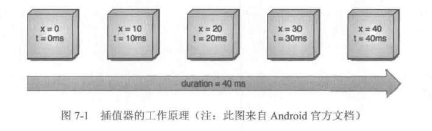

## 动画

Android的动画可以分为三种:View动画、帧动画和属性动画，其实动画也属于 View动画的一种，只不过它和平移、旋转等常见的 View动画在表现形式上略有不同而已。View动画通过对场景里的对象不断做图像变换 (平移、缩放、旋转、透明度)从而产生动画效果，它是一种渐近式动画，并且 View 动画支持自定义。帧动画通过顺序播放一系列图像从而产生动画效果，可以简单理解为图片切换动画，很显然，如果图片过多过大就会导致OOM.属性动画通过动态地改变对象的属性从而达到动画效果，属性动画为API11 的新特性，在低版本无法直接使用属性动画，但是我们仍然可以通过兼容库来使用它。

### View动画

View动画的作用对象是 View，它支持 4种动画效果，分别是平移动画、缩放动画、旋转动画和透明度动画。除了这四种典型的变换效果外，帧动画也属于 View 动画，但是帧动画的表现形式和上面的四种变换效果不太一样。

View动画的四种变换效果对应着 Animation 的四个子类:TranslateAnimation、ScaleAnimation、RotateAnimation 和AlphaAnimation，这四种动画既可以通过XML 来定义，也可以通过代码来动态创建，对于 View 动画来说，建议采用XML 来定义动画，这是因为XML格式的动画可读性更好。要使用View动画，首先要创建动画的XML文件，这个文件的路径为res/anim/filename.xml


```

	<set xmlns:android="http://schemas.android.com/apk/res/android"
	    android:interpolator="@[package:]anim/interpolator_resource"
	    android:shareInterpolator="true|false">

	    <alpha
	        android:fromAlpha="float"
	        android:toAlpha="float" />
	
	    <scale
	        android:fromXScale="float"
	        android:fromYScale="float"
	        android:pivotX="float"
	        android:pivotY="float"
	        android:toXScale="float"
	        android:toYScale="float" />
	
	    <translate
	        android:fromXDelta="float"
	        android:fromYDelta="float"
	        android:toXDelta="float"
	        android:toYDelta="float" />
	
	    <rotate
	        android:fromDegrees="float"
	        android:pivotX="float"
	        android:pivotY="float"
	        android:toDegrees="float" />
	    <set>
	
	    </set>
	</set>
```

从上面的语法可以看出，View动画既可以是单个动画，也可以由一些列动画组成。
<set>标签表示动画集合，对于AnimationSet类，它可以包含若干个动画，并且它的内部也是可以嵌套其他动画集合的，它的属性

**android:interpolator**

表示动画集合所采用的插值器，插值器影响动画的速度，比如非匀速动画就是需要通过插值器来控制动画的播放过程。这个事项可以不指定，默认为@android:anim/accelerate_decelerate_interpolator，即加速减速插值器，关于插值器的概念会在下面进行具体介绍。

**android:shareInterpolator**

表示集合中的动画是否和集合共同享用一个插值器。如果集合不指定插值器，那么子动画就需要单独指定所需的插值器或者使用默认值;

translate标签标示平移动画，对应TranslateAnimation类，它可以使一个View再水平和竖直方向完成平移的动画效果，它的一些列属性的含义如下：

- android:fromXDetla——表示x起始值，比如0；
- android:toXDelta——表示x的结束值，比如100；
- android:fromYDelta——表示y的起始值。
- android:toYDelta——表示y的结束值。

scale标签表示缩放动画，对应ScaleAnimation，它可以使View具有放大活缩小的动画效果，它的一些列属性的含义如下：

- android:fromXScale——水平方向缩放的起始值，比如0.5；
- android:toXScale——水平方向缩放的结束值，比如1.2；
- android:fromYScale——竖直方向缩放的起始值。
- android:toYScale——竖直方向缩放的结束值。
- android:pivotX——缩放的轴点x坐标，它会影响缩放的效果。
- android:pivotY——缩放的轴点y坐标，它会影响缩放的效果。


在scale标签中提到了轴点的概念，这里举个例子，默认情况下轴点是View的中心点，这个时候在水平方向进行缩放的话会导致 View 向左右两个方向同时进行缩放，但是如果把轴点设为 View的右边界，那么 View 就只会向左边进行缩放，反之则向右边进行缩放，具体效果读者可以自己测试一下。

rotate标签表示旋转动画，对应RotateAnimation，它可以使用View具有旋转的动画效果，它的属性含义如下：

- android:fromDegrees——旋转开始的角度，比如0；
- android:toDegrees——旋转结束的角度，比如180；
- android:pivotX——旋转的轴点x坐标。
- android:pivotY—— 旋转 的轴点y坐标。

在旋转动画中也有轴点的概念，它也会影响到旋转的具体效果。在旋转动画中，轴点扮演着旋转轴的角色，即View是围绕着轴点进行旋转的，默认情况下轴点为View的中心。考虑一种情况，View围绕着自己的中心点和围绕着自己的左上角旋转90度显然是不同的旋转轨迹，不同轴点对旋转效果的影响可以自己测试一下。

alpha标签表示透明度动画，对应AlphaAnimation，它可以改变View的透明度，它的属性含义如下：

- android:fromAlpha——表示透明度的起始值，比如0.1；
- android:toAlpha——表示透明度的结束值，比如1；

上面简单介绍了View动画的XML格式，具体的使用方法查看相关文档。除了上面介绍的属性以外，View动画还有一些常用的属性，如下所示。

- android:duration——动画的持续时间；
- android:fillAfter——动画结束以后View是否在结束位置，true表示停留在结束为止，false则不停留。

如何应用上面的动画呢？

```

	Button button = (Button)findViewById(R.id.button1);
	Animation animation = AnimationUtils.loadAnimation(this,R.anim.examp1);
	button.startAnimation(animation);
```

除了在XML 中定义动画外，还可以通过代码来应用动画，这里举个例子，如下所示

```

	AlphaAnimation alphaAnimation = new AlphaAnimation(0，1);
	alphaAnimation.setDuration(300);
	mButton.startAnimation(alphaAnimation);
```

通过Animation的setAnimationListener方法可以给View动画添加过程监听

### 帧动画
帧动画是顺序播放一组预先定义好的图片，类似于电影播放。不同于View动画，系统提供了另外一个类AnimationDrawable来使用帧动画。帧动画的使用比较简单，首先需要通过XML(res/drawable下)来定义一个 AnimationDrawable，如下所示。
```

	<?xml version="1.0" encoding="utf-8"?>
	<animation-list xmlns:android="http://schemas.android.com/apk/res/android"
	    android:oneshot="false">
	    <item android:drawable="@drawable/image1" android:duration="500"/>
	    <item android:drawable="@drawable/image2" android:duration="500"/>
	    <item android:drawable="@drawable/image3" android:duration="500"/>
	</animation-list>
```

然后将上述的Drawable作为View的背景并通过Drawable来播放动画即可：
```

	final Button button = (Button)findViewById(R.id.button1);
	button.setBackgroundResource(R.drawable.frame_animation);
	AnimationDrawable drawable = (AnimationDrawable)button.getBackground();
	drawable.start();
```
帧动画的使用比较简单，但是比较容易引起OOM，所以在使用帧动画时尽量避免使用过多尺寸较大的图片

### View动画的特殊使用场景

#### LayoutAnimation
LayoutAnimation作用于ViewGroup，为ViewGroup指定一个动画，这样当它的子元素出场时都会具有这种动画效果。这种效果常常被用在ListView上，我们市场会看到一种特殊的ListView，它的每个item都以一定的动画的形式出现，其实这并非什么高深的技术，它使用的就是 LayoutAnimation。 LayoutAnimation也是一个View动画，为了给ViewGroup的子元素加上出场效果，遵循如下几个步骤。
（1）定义 LayoutAnimation，如下所示(res/anim/anim_layout.xml)。

```
	
	<?xml version="1.0" encoding="utf-8"?>
	<layoutAnimation xmlns:android="http://schemas.android.com/apk/res/android"
	    android:delay="0.5"
	    android:animationOrder="normal"
	    android:animation="@anim/anim_item"/>

```

属性的含义如下所示。

**android:delay**

表示子元素开始动画的时间延迟，比如子元素入场动画的时间周期为300ms，那么0.5表示每个子元素都需要延迟150ms才能播放入场动画，总体来说，第一个子元素延迟150ms开始播放入场动画，第2个子元素延迟300ms开始播放入场动画，依次类推。

**android:animationOrder**

表示子元素动画的顺序，有三种选项：normal、reverse和random，其中normal表示顺序显示，即排在前面的子元素先开始播放入场动画；reverse表示逆向显示，即排在后面的子元素先开始播放入场动画；random则是随机播放入场动画。

**android:animation**

为子元素指定具体的入场动画。

(2)为子元素指定具体的入场动画，如下所示。
```

	<?xml version="1.0" encoding="utf-8"?>
	<set xmlns:android="http://schemas.android.com/apk/res/android"
	    android:duration="300"
	    android:interpolator="@android:anim/accelerate_interpolator"
	    android:shareInterpolator="true">
	    <alpha android:toAlpha="1.0"
	        android:fromAlpha="0.0"/>
	    <translate android:fromXDelta="500"
	        android:toXDelta="0"/>
	</set>
```
（3）为ViewGroup指定android:layoutAnimation属性。对于ListView来说，这样ListView的item就具有出场动画了，这种方式适用于所有的ViewGroup，如下所示。
```

    <ListView
        android:id="@+id/list_view"
        android:layout_width="match_parent"
        android:layout_height="match_parent"
        android:layoutAnimation="@anim/anim_layout"
        android:background="#fff4f7f9"
        android:cacheColorHint="#00000000"
        android:divider="#dddbbd"
        android:dividerHeight="1dp"
        android:listSelector="@android:color/transparent"/>
```
除了再XML指定 layoutAnimation外，还可以通过LayoutAnimationController来实现，具体代码如下所示。
```

        ListView list_view = ((ListView)findViewById(R.id.list_view));
        list_view.setAdapter(getAdapter());
        Animation animation = AnimationUtils.loadAnimation(this, R.anim.anim_item);
        LayoutAnimationController controller = new LayoutAnimationController(animation);
        controller.setDelay(0.5f);
        controller.setOrder(LayoutAnimationController.ORDER_NORMAL);
        list_view.setLayoutAnimation(controller);
```

#### Activity的切换效果

Activity有默认的切换效果，但是这个效果我们是可以自定义的，主要用到overridePendingTransition(int enterAnim, int exitAnim)这个方法，这个方法必须再startActivity(Intent)或者finish之后被调用才能生效，它的参数含义如下：

- enterAnim——Activity被打开时，所需要的动画资源id；
- exitAnim——Activity被暂停时，所需的动画资源id；

当启动一个Activity时，可以按照如下方式为其添加自定义的切换效果：
```

        Intent intent = new Intent(this, DemoActivity_1.class);
        startActivity(intent);
        overridePendingTransition(R.anim.enter_anim, R.anim.exit_anim);
```

当Activity退出时，也可以为其指定自己的切换效果，如下所示。
```

    @Override
    public void finish() {
        super.finish();
        overridePendingTransition(R.anim.enter_anim, R.anim.exit_anim);
    }
```
需要注意的是，overridePendingTransition这个方法必须位于startActivity或者finish的后面，否则动画效果将不起作用。
Fragment也可以添加切换动画，由于Fragment是再API11中引入的类，因此为了兼容性，我们需要使用support-v4这个兼容包，在这种情况下我们可以通过FragmentTransaction中的setCustomAnimations方法来添加切换动画。这个切换动画需要是View动画，之所以不能采用属性动画是因为属性动画也是API11新引入的。还有其他方式可以给Activity和Fragment添加切换动画，但是它们大多都有兼容性问题，在低版本上无法使用，因此不具有很高的使用加直，这里就不再一一介绍了。


### 属性动画

#### 使用属性动画
属性动画可以对任意对象进行动画而不仅仅是View，动画默认时间间隔300ms，默认帧率10ms/帧。其可以达到的效果是，在一个时间间隔内完成对象从一个属性值到另一个属性值的改变。因此属性动画几乎是无所不能的，只要对象有这个属性，它都能实现动画效果。但是属性动画从API11才有，这就严重制约了属性动画的使用。可以采用开源动画库nineoldandroids来兼容以前的版本，采用 nineoldandroids，可以在API11以前的系统上使用属性动画， nineoldandroids的网址是：http:// nineoldandroids.com。

nineoldandroids对属性动画做了兼容，在API 11以前的版本其内部是通过代理View动画来实现的，因此在低Android版本上，它的本质是View动画，尽管使用方法看起来是属性动画。nineoldandroids的功能和系统原始对android.animation.*中类的功能完全一致，使用方法也完全一样，只要我们用nineoldandroids来编写动画，就可以在所有的Android系统上运行。比较常用的几个动画类是：ValueAnimator、ObjectAnimator和AnimatorSet，其中ObjectAnimator继承自ValueAnimator，AnimatorSet是动画集合，可以定义一组动画，它们使用起来也是及其简单的。如何使用属性动画呢？下面举几个小例子。

（1）改变一个对象(myObject)的translationY属性，让其沿着Y轴向上平移一段距离：它的高度，改动画在默认时间内完成，动画完成时间是可以自定义的。想要灵活的效果我们还可以定义插值器和估值算法，但是一般来说我们不需要自定义，系统已经预置了一些，能够满足常用的动画。
```

    ObjectAnimator.ofFloat(myObject, "translationY", -myObject.getHeight()).start();
```
（2）改变一个对象的背景色属性，典型的情形是改变View的背景色，下面的动画可以让背景色在3秒内实现从0xFFFF8080到0xFF8080FF的渐变，动画会无线循环而且会有反转的效果。
```

    ValueAnimator colorAnim = ObjectAnimator.ofInt(button, "backgroundColor",0xFFFF8080,0xFF8080FF);
    colorAnim.setDuration(3000);
    colorAnim.setEvaluator(new ArgbEvaluator());
    colorAnim.setRepeatCount(ValueAnimator.INFINITE);
    colorAnim.setRepeatMode(ValueAnimator.REVERSE);
    colorAnim.start();
```
（3）动画集合，5秒内对View的旋转、平移、缩放和透明度都进行了改变。
```

        AnimatorSet set = new AnimatorSet();
        set.playTogether(
                ObjectAnimator.ofFloat(button,"rotationX", 0,360),
                ObjectAnimator.ofFloat(button,"rotationY", 0,180),
                ObjectAnimator.ofFloat(button,"rotation", 0,-90),
                ObjectAnimator.ofFloat(button,"translationX", 0,90),
                ObjectAnimator.ofFloat(button,"translationY", 0,90),
                ObjectAnimator.ofFloat(button,"scaleX", 1,1.5f),
                ObjectAnimator.ofFloat(button,"scaleY", 1,0.5f),
                ObjectAnimator.ofFloat(button,"alpha", 1,0.25f,1)
 
        );
        set.setDuration(5000).start();
        set.start();
```
属性动画除了通过代码实现以外，还可以通过XML来定义。属性动画需要定义在res/animator/目录下，它的语法如下所示。
```

	<?xml version="1.0" encoding="utf-8"?>
	<set xmlns:android="http://schemas.android.com/apk/res/android"
	    android:ordering="together|sequentially">
	    <objectAnimator android:propertyName="string"
	        android:duration="int"
	        android:valueFrom="float|int|color"
	        android:valueTo="float|int|color"
	        android:valueType="pathType|floatType|intType|colorType"
	        android:startOffset="int"
	        android:repeatCount="int"
	        android:repeatMode="restart|reverse"/>
	    <animator android:duration="int"
	        android:valueFrom="float|int|color"
	        android:valueTo="float|int|color"
	        android:valueType="pathType|floatType|intType|colorType"
	        android:startOffset="int"
	        android:repeatCount="int"
	        android:repeatMode="restart|reverse"/>
	    <set>
	        ...
	    </set>
	</set>
```

属性动画的各种参数都比较好理解，在XML中可以定义ValueAnimator、ObjectAnimator以及AnimatorSet，其中<set>标签对于 AnimatorSet，objectAnimator标签则对应 ObjectAnimator，animator标签对应ValueAnimator。set标签的android:ordering属性有两个可选值：together和sequentially，其中together表示动画集合中的子动画同时播放， sequentially则表示动画集合中的子动画按照前后顺序依次播放， android:ordering属性默认值是together。

对于objectAnimator标签的各个属性的含义，下面简单说明一下，对于 animator标签这里就不再介绍了，因为它只是比 objectAnimator少了个android:propertyName属性而已，其他都是一样的。

- android:propertyName——表述属性动画的作用对象的属性的名称；
- android:duration——表示动画的时长；
- android:valueFrom——表示属性的起始值；
- android:valueTo——表示属性的结束值；
- android:startOffset——表示动画的延迟时间，当动画开始后，需要延迟多说毫秒才会真正播放此动画；
- android:repeatCount——表示动画的重复次数；
- android:repeatMode——表示动画的重复模式；
- android:valueType——表示 android:propertyName所指定的属性的类型，有intType和floatType两个可选项，分别表示属性的类型为整型和浮点型。另外，如果 android:propertyName所指定的属性表示的是颜色，那么不需要指定 android:valueType，系统会自动对颜色类型的属性做处理。

对于一个动画来说，有两个属性这里要特殊说明一下，一个是 android:repeatCount，它表示动画循环的次数，默认值为0，其中-1表示无线循环；另外一个是 android:repeatMode，它表示动画循环的模式，有两个选项：repeat和reverse，分别表示连续重复和逆向重复。连续重复比较好理解，就是动画每次都重写开始播放，而逆向重复是指第一次播放完以后，第二次会倒着播放，第三次再重投开始播放动画，第四次再倒着播放动画，如此反复。
下面是一个具体的例子，我们通过XML定义一个属性动画并将其作用再View上，如下所示。

```

	<?xml version="1.0" encoding="utf-8"?>
	<set xmlns:android="http://schemas.android.com/apk/res/android"
	    android:ordering="together">
	    <objectAnimator android:propertyName="translationX"
	        android:duration="3000"
	        android:valueTo="100"
	        android:valueType="floatType"/>
	 
	    <objectAnimator android:propertyName="translationY"
	        android:duration="3000"
	        android:valueTo="300"
	        android:valueType="floatType"/>
	</set>
```
如何使用上面的属性动画呢？也很简单，如下所示。
```

        AnimatorSet set = (AnimatorSet)AnimatorInflater.loadAnimator(this,R.animator.property_animator);
        set.setTarget(button);
        set.start();
```
在实际的开发中建议采用代码来实现属性动画，这时因为通过代码来实现比较简单。更重要的是，很多时候一个属性的起始值是无法提前确定的，比如让一个Button从屏幕左边移动到屏幕的右边，由于我们无法提前知道屏幕的宽度，因此无法将属性动画定义在XML中，在这种情况下就必须通过代码来动态的创建属性动画。


#### 理解插值器和估值器
TimeInterpolator中文翻译为时间插值器，它的作用是根据时间流逝的百分比来计算出当前属性值改变的百分比，系统预置的有LinearInterpolator（线性插值器：匀速动画）、AccelerateDecelerate Interpolator（加速减速插值器：动画两头慢中间快）和Decelerate Interpolator（减速插值器：动画越来越慢）等。TypeEvaluator的中文翻译为类型估值算法，也叫估值器，它的作用是根据当前属性改变的百分比来计算改变后的属性值，系统预置的有IntEvaluator（针对整型属性）、FloatEvaluator（针对浮点型属性）和ArgbEvaluator（针对Color属性）。属性动画中的插值器（ Interpolator）和估值器（ Evaluator）很重要，它们是实现非匀速动画的重要手段。可能这么说还有点晦涩，没关系，下面各处一个示例就很好理解了。
如下图所示，他是一个匀速动画，采用了线性插值器和整型估值算法，在40ms内，View的x属性从0到40的变换。

由于动画的默认属性率为10ms/帧，所有改动画将分为5帧进行，我们来考虑第三帧(x=20, t=20ms)，当t=20ms的时候，时间的流逝的百分比是0.5（20/40=0.5），意味着现在时间过了一般，那x应该改变多说呢？这个就是由插值器和估值算法来确定。拿线性插值器来说，当时间流逝一半的时候，x的变换应该是一般，即x的改变是0.5，为什么呢？因为它是线性插值器，是实现匀速动画的，下面看它的源码：
```

	public class LinearInterpolator extends BaseInterpolator implements NativeInterpolatorFactory {
	 
	    public LinearInterpolator() {
	    }
	 
	    public LinearInterpolator(Context context, AttributeSet attrs) {
	    }
	 
	    public float getInterpolation(float input) {
	        return input;
	    }
	
	}
```

很显然，线性插值器的返回值和输入值一样，因此插值器返回的值是0.5，这意味着x改变的是0.5，这个时候插值器的工作就完成了。具体x变成了什么值，这个需要估值算法来确定，我们来看看整型估值算法的源码。
```

	public class IntEvaluator implements TypeEvaluator<Integer> {
	    public Integer evaluate(float fraction, Integer startValue, Integer endValue) {
	        int startInt = startValue;
	        return (int)(startInt + fraction * (endValue - startInt));
	    }
	}
```

上述算法很简答，evaluate的三个参数分别表示估值小数、开始值和结束值，对应于我们的例子就分别是0.5、0、40。根据上述算法，整型估值返回给我的结果就是20，这就是(x=20,t=20ms)的由来。
属性动画要求对象的该属性由set方法和get方法(可选)。插值器和估值算法除了系统提供的外，我们还可以自定义。实现方式也很简单，因为插值器和估值算法都是一个接口，且内部只有一个方法，我们只要派生一个类实现接口就可以了，然后就可以做出千奇百怪的动画效果了。具体一点就是：自定义插值器需要实现Interpolator或者Time Interpolator，自定义估值算法需要实现TypeEvaluator。另外就是如果要对其他类型(非int、float、Color)做动画，那么必须要自定义类型估值算法。

#### 属性动画的监听器

属性动画提供了监听器用于监听动画的播放过程，主要有如下两个接口：AnimatorUpdateListener和AnimatorListener。

AnimatorListener的定义如下：
```

	public static interface AnimationListener { 
		void onAnimationStart(Animator animation); 
		void onAnimationEnd(Animator animation); 
		void onAnimationRepeat(Animator animation);
	    void onAnimationCancel(Animator animation);
	 }
```
从AnimatorListen可以看出，它可以监听动画的开始、结束以及重复播放。同时为了方便开发，系统还提供了AnimatorListenerAdapter这个类，他是AnimatorListener的适配器，这样我们就可以有选择地实现上面的4个方法了，毕竟不是所有方法都是我们感兴趣的。
下面再看一下AnimatorUpdateListener的定义，如下所示。
```

    public static interface AnimatorUpdateListener {
        void onAnimationUpdate(ValueAnimator animation);
    }
```
AnimatorUpdateListener比较特殊，它会监听整个动画过程，动画是由许多帧组成的，没播放一帧，onAnimationUpdate就会被调用一次，利用这个特性，我们可以做一些特殊的事情。

#### 对任意属性做动画
这里先提出一个问题：给Button加一个动画，让这个Button的宽度从当前宽度增加到500px。也许你会说，这很简单，用View动画就可以搞定，我们可以来试试，你能写出来吗？ 很快你就会恍然大悟，原来View动画根本就不支持对宽度进行动画。没错，View动画只支持四种类型：平移、旋转、缩放、不透明度。当x方向的缩放可以让Buttonx方向方法，看起来好像是宽度增加了，实际上不是，只是Button被放大了而已，而且由于只是x方向被放大，这个时候Button的背景以及上面的文本都被拉伸了，甚至由可能Button会超出屏幕。这样的的效果显然是很差的，而且也不是真正地对宽度做动画。不过索性我们还有属性动画，我们用属性动画试试，如下所示。
```

    private void performAnimate() {
        ObjectAnimator.ofInt(mButton,"width",500).setDuration(5000).start();
    }
 
    @Override
    public void onClick(View v) {
        if (v == mButton){
            performAnimate();
        }
    }
```
上述代码运行后发现没效果，其实没效果是对的，如果随便传递一个属性过去，轻则没有动画效果，重则程序直接Crash。
下面分析属性动画的原理：属性动画要求动画作用的对象提供该属性的set和get方法，属性动画根据外界传递的该属性的初始值和最终值，以动画的效果多次去调用set方法，每次传递给set方法的值都不一样，确切来说是随着时间的推移，所传递的值越来越接近最终值。总结一下，我们对object的属性abc做动画，如果想让动画生效，需要同时满足两个条件：

（1）object必须要提供setAbc方法，如果动画的时候没有传递初始值，那么还要提供getAbc方法，因为系统要去取abc属性的初始值(如果这条不满足，程序直接Crash);

（2）object的setAbc对属性abc所做的改变必须能够通过某种方法反映出来，比如会带来UI的改变之类的(如果这条不满足，动画无效果但不会Crash)。

以上条件缺一不可。那么为什么我们对Button的width属性做动画会没有效果？这时因为Button内部虽然提供了getWidth和setWidth，但是这个setWidth方法并不是改变视图的大小，他是TextView新添加的方法，View是没有这个setWidth方法的，由于Button继承了TextView，所以Button也就由了setWidth方法。下面看一下这个getWidth和setWidth方法的源码。
```

    @android.view.RemotableViewMethod
    public void setWidth(int pixels) {
        mMaxWidth = mMinWidth = pixels;
        mMaxWidthMode = mMinWidthMode = PIXELS;
 
        requestLayout();
        invalidate();
    }
    
    @ViewDebug.ExportedProperty(category = "layout")
    public final int getWidth() {
        return mRight - mLeft;
    }
```

从上述源码可以看出， getWidth的确是获取View的宽度的，而setWidth是TextView和其子类的专属方法，它的作用不是设置View的宽度，而是设置TextView的最大宽度和最小宽度的，这个和TextView的宽度不是一个东西。具体来说，TextView的宽度对于XML中的android:layout_width属性，而TextView还有一个属性android:width，这个 android:width属性就对应了TextView的setWidth。总之，TextView和Button的setWidth、getWidth干的不是同一件事情，通过 setWidth无法改变空间的宽度，所以对width做属性动画没有效果。对应于动画的两个条件来说，本例中动画不生效的原因是满足了条件1而未满足条件2.

针对上述问题，官方文档告诉我们有三种解决方法：

- 给你对象加上get和set方法，如果你有权限的话；

- 用一个类来包装原始对象，间接为其提供get和set方法；

- 采用ValueAnimator，监听动画过程，自己实现属性的改变。

针对上面提出的三种解决办法，下面给出具体的介绍。

1. 给你的对象加上get和set方法，如果你有权限的话
这个意思很好理解，如果你有权限的话，加上get和set就搞定了。但是很多时候我们没权限去这么做。比如文本开头所提到的问题，你无法给Button加上一个合乎要求的setWidth方法，因为这时Android SDK内部实现的。这个方法最简单，但是往往不可行的，这里就不对其进行更多的分析了。

2. 用一个类来包装原始对象，间接为其提供get和set方法
这是一个很有用的解决办法，是笔者最喜欢用的，因为用起来很方便，也很好理解，下面将通过一个具体的例子来介绍它。

```

    private void performAnimate() {
        ViewWrapper wrapper = new ViewWrapper(mButton);
        ObjectAnimator.ofInt(wrapper,"width",500).setDuration(5000).start();
    }
 
    @Override
    public void onClick(View v) {
        if (v == mButton){
            performAnimate();
        }
    }
 
    private static class ViewWrapper {
        private View mTarget;
 
        public ViewWrapper(View target) {
            this.mTarget = target;
        }
        public int getWidth() {
            return mTarget.getLayoutParams().width;
        }
        public void setWidth(int width){
            mTarget.getLayoutParams().width = width;
            mTarget.requestLayout();
        }
    }
```

上述代码再5s内让Button的宽度增加到了500px，为了达到这个效果，我们提供了ViewWrapper类专门用于包装View，具体到本例是包装Button。然后我们对ViewWrapper的width属性做动画，并且setWidth方法中修改器内部的target的宽度，而target实际上就是我们包装的Button。这样一个间接属性动画就搞定了，上述代码同样适用于一个对象的其他属性。

3. 采用ValueAnimator，监听动画过程，自己实现属性的改变
首先说说什么是 ValueAnimator， ValueAnimator本身不做用于任何对象，也就是说直接使用它没有任何动画效果。它可以对一个值做动画，然后我们可以监听其动画过程，再动画过程中修改我们的对象的属性值，这样也就相当于我们的对象做了动画。下面用例子来说明：

```

    private void performAnimate(final View target, final int start, final int end) {
        ValueAnimator valueAnimator = ValueAnimator.ofInt(1,100);
        valueAnimator.addUpdateListener(new ValueAnimator.AnimatorUpdateListener() {
            //持有一个IntEvaluator对象，下面方便估值的时候使用
            private IntEvaluator mEvaluator = new IntEvaluator();
 
            @Override
            public void onAnimationUpdate(ValueAnimator animator) {
                //获得当前动画的进度值，整数，1~100之间
                int currentValue = (Integer)animator.getAnimatedValue();
                Log.d(TAG, "current value: " + currentValue);
 
                //获得当前进度栈整个动画过程的比例，浮点型，0~1之间
                float fraction = animator.getAnimatedFraction();
 
                //直接用用整型估值器，通过比例计算出宽度，然后再设给Button
                target.getLayoutParams().width = mEvaluator.evaluate(fraction, start, end);
                target.requestLayout();
            }
        });
        valueAnimator.setDuration(5000).start();
    }
 
    @Override
    public void onClick(View v) {
        if (v == mButton){
            performAnimate(mButton, mButton.getWidth(), 500);
        }
    }
```

上述代码的效果图和采用ViewWrapper是一样的。关于这个ValueAnimator要再说一下，拿上面的例子来说，它会再5000ms内将一个数从1变到100，然后动画的每一帧会回调onAnimationUpdate方法。再这个方法里，我们可以获取当前的值（1~100）和当前值所占的比例，我们可以计算出Button现在的宽度应该是多少。比如时间过了一般，当前值是50，比例为0.5，假设Button的起始宽度是100px，最终宽度是500px，那么Button增加的宽度也应该占总增加宽度的一半，总增加宽度是500-100=400，所以这个时候Button应该增加的宽度是400*0.5=200，那么当前Button的宽度应该为初始宽度+增加宽度（100+200=300）。上述计算过程很简单，其实他就是整型估值器IntEvaluator，所以我们不用自己写了，直接用吧。

### 使用动画的注意事项

通过动画可以实现一些比较绚丽的效果，但是在使用过程中，也需要注意一些事情，主要分为下面几类。

1.OOM问题

这个问题主要出现在帧动画中，当图片数量较多且图片较大时就容易出现OOM，这个在实际开发中尤其注意，尽量避免使用帧动画。

2.内存泄漏

在属性动画中有一类无线循环的动画，这类动画需要在Activity退出时及时停止，否则将会导致Activity无法释放从而造成内存泄漏，通过验证后发现View动画并不存在此问题。

3.兼容性问题

动画在3.0以下的系统上有兼容性问题，在某些特殊场景可能无法正常工作，因此要做好适配工作。

4.View动画的问题

View动画是对View的影像做动画，并不是真正地改变View地状态，因此有时会出现动画完成后View无法隐藏地现象，即setVisibility(View.GONE)失效了，这个时候只要调用view.clearAnimation()清楚View动画即可解决此问题。

5.不要使用px

在进行动画的过程中，要尽量使用dp，使用px会导致在不同的设备上有不同的效果。

6.动画元素的交互

将view平移后，在Andre 3.0以前的系统上，不管是View动画还是属性动画，新位置均无法交互，同时老位置仍然可以触发单击事件。尽管View以及在视觉上不存在了，将View移回原位以后，原位置的单击事件继续生效。从3.0开始，属性动画的单击事件触发为止为移动后的位置，但是View动画仍然在原位置。

7.硬件加速

使用动画的过程中，建议开启硬件加速，这样会提高动画的流畅性。