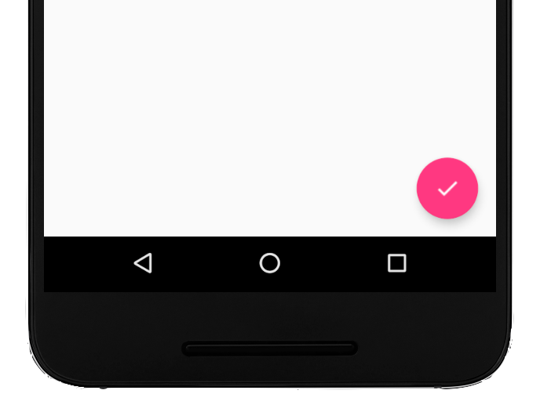

## Compose
setContent函数会提供一个Composable作用域，所以在它的闭包中我们就可以随意地调用Composable函数了。
所有的Composable函数还有一个约定俗成的习惯，就是函数的命名首字母需要大写。
Surface函数是Material库中提供的一个通用函数，它的主要作用是为了让应用程序可以更好地适配Material Design，例如控制阴影高度、控制内容颜色、裁剪形状等等。

### 基础控件
#### Text

Text的用法非常简单，只需要给它指定一个text参数，里面传入要显示的内容即可。除此之外，Text还能实现很多其他的功能，通过观察它的参数列表便可略之一二：

```
fun Text(
    text: String,
    modifier: Modifier = Modifier,
    color: Color = Color.Unspecified,
    fontSize: TextUnit = TextUnit.Unspecified,
    fontStyle: FontStyle? = null,
    fontWeight: FontWeight? = null,
    fontFamily: FontFamily? = null,
    letterSpacing: TextUnit = TextUnit.Unspecified,
    textDecoration: TextDecoration? = null,
    textAlign: TextAlign? = null,
    lineHeight: TextUnit = TextUnit.Unspecified,
    overflow: TextOverflow = TextOverflow.Clip,
    softWrap: Boolean = true,
    maxLines: Int = Int.MAX_VALUE,
    onTextLayout: (TextLayoutResult) -> Unit = {},
    style: TextStyle = LocalTextStyle.current
) {
    ...
}
```

#### Button
Button应该是仅次于Text之后最常用的控件了。这个相信不需要我介绍大家也都知道是用来做什么的，因为它和View中的Button名字完全相同。不同的是，在View当中，Button是TextView的子类，它们之间是继承的关系。因此，Button实际上是在TextView的基础之上做了功能扩展，使得控件可以点击了。
而在Compose当中，Button和Text之间并没有什么关系。它们是两个独立的控件，并且通常它们还需要配合在一起使用才行。Button的参数列表上还有一个onClick参数，这是一个必填参数，当按钮点击时，就会执行这个参数里指定的逻辑。
为了演示一下这个功能，我们就让点击按钮时弹出一个Toast提示吧。
```
@Composable
fun SimpleWidgetColumn() {
    Column {
        ...
        val context = LocalContext.current
        Button(onClick = {
            Toast.makeText(context, "This is Toast", Toast.LENGTH_SHORT).show()
        }) {
            Text(
                text = "This is Button",
                color = Color.White,
                fontSize = 26.sp
            )
        }
    }
}
```
注意，要想弹出Toast需要有Context参数才行。在Composable函数当中获取Context对象，可以调用LocalContext.current获得。

#### TextField

TextField对应的是View当中的EditText，也就是一个输入框，因此它也是一个非常常用的控件。
首先我们尝试在界面上添加一个TextField吧，代码如下所示：

```
@Composable
fun SimpleWidgetColumn() {
    Column {
        ...
        TextField(value = "", onValueChange = {})
    }
}
```
TextField参数列表上有两个必填参数，其中value参数用于指定当前输入框中显示的文字内容，onValueChange参数用于监听输入框中的文字内容变化。
到这里为止还算比较简单，可是当你尝试在输入框里输入内容时，你会发现不管你在键盘上敲了什么东西，输入框上都不会显示出来。这是和EditText最大的不同点，因为EditText一定是可以显示你输入的内容的。

声明式UI的工作流程有点像是刷新网页一样。即我们去描述一个控件时要附带上它的状态。然后当有任何状态需要发生改变时，只需要像刷新网页一样，让界面上的元素刷新一遍，那么自然状态就能得到更新了。

而TextField中显示的内容就是一种状态，因为随着你的输入，界面上显示的内容也需要跟着更新才行。
那么这里，当在TextField中输入内容时，首先我们并没有去做刷新页面这个操作。其次，就算是做了刷新操作，TextField刷新后发现value参数指定的内容仍然是一个空字符串，因此我们输入的内容还是无法上屏。

现在问题的原因已经解释清楚了，那么要如何解决呢？这就得借助Compose的State组件了。不过这是另外一个知识点，我打算在之后的文章中讲解，本篇文章我不想过于发散，暂时我们还是把精力聚焦在基础控件和布局上，就先跳过这个问题吧。
TextField同样也提供了非常丰富的API来来允许我们对它进行定制。比如，EditText有一个hint属性，用于在输入框里显示一些提示性的文字，然后一旦用户输入了任何内容，这些提示性的文字就会消失。
这里通过placeholder参数来指定一个占位符，其实就是和hint差不多的功能，用户没有在输入框里输入任何内容时就显示placeholder中的内容，一旦用户输入了任何内容，placeholder就会消失。
可以通过TextFieldDefaults调整TextField的输入框背景色：TextFieldDefaults可以支持调整任何你想要调整的颜色，可不仅仅是输入框背景色，具体的用法参考一下它的参数列表你就知道了。
```
@Composable
fun SimpleWidgetColumn() {
    Column {
        ...
        TextField(
            value = "",
            onValueChange = {},
            placeholder = {
                Text(text = "Type something here")
            },
            colors = TextFieldDefaults.textFieldColors(
                backgroundColor = Color.White
            )
        )
    }
}
```

#### Image
Image对应的是View当中的ImageView，也就是用于展示图片的。首先来看一下drawable资源形式的图片要如何加载，代码如下所示：

```
@Composable
fun SimpleWidgetColumn() {
    Column {
        ...
        Image(
            painter = painterResource(id = R.drawable.dog),
            contentDescription = "A dog image"
        )
    }
}
```
Image参数列表上有两个必填参数，其中painter参数用于指定要展示的drawable资源，contentDescription参数用于指定对于这个资源的文字描述。
这个文字描述主要是在accessibility模式下，为有视觉障碍的群体提供发音辅助的。ImageView上也有类型的功能，但只是作为一项可选的属性提供。而到了Compose的Image上，则变成了一个强制性的参数。
当然，如果你就是不想要为图片指定contentDescription，也可以直接传null。
再来看一下bitmap形式的图片要如何加载：

```
@Composable
fun SimpleWidgetColumn() {
    Column {
        ...
        val bitmap: ImageBitmap = ImageBitmap.imageResource(id = R.drawable.dog)
        Image(
            bitmap = bitmap,
            contentDescription = "A dog image"
        )
    }
}
```

先借助ImageBitmap.imageResource函数将drawable资源转换成了一个ImageBitmap对象，然后再将它转给Image控件即可。

需要注意的是，Image接收的是Compose中专有的ImageBitmap对象，而不是传统的Bitmap对象。如果你这里要传入的是一个传统的Bitmap对象，那么还得再额外调用asImageBitmap函数转换一下，如下所示：

```
@Composable
fun SimpleWidgetColumn(bitmap: Bitmap) {
    Column {
        ...
        Image(
            bitmap = bitmap.asImageBitmap(),
            contentDescription = "A dog image"
        )
    }
}
```
到目前为止，我们展示的都是本地的图片资源。那么如果想要展示一张网络图片资源要怎么办呢？

很遗憾，Compose提供的Image是没有这个能力的，我们需要借助第三方依赖库才行。当然，ImageView也是没有这个能力的，所以我们以前也会使用Glide这样的第三方库。
目前Google比较推荐的第三方Compose图片加载库是Coil和Glide这两个。我知道大家看到Glide一定会感到非常亲切，可能更倾向于使用这个。但实际上Coil是一个基于协程开发的新兴图片加载库，用法更加贴合Kotlin也更加简单，因此我更推荐使用这个新库。

要使用Coil，首先需要将它引入到我们的项目当中：

```
dependencies {
    implementation("io.coil-kt:coil-compose:2.4.0")
}
```
接下来使用Coil提供的AsyncImage控件即可轻松加载网络图片资源了，代码如下所示：

```
@Composable
fun SimpleWidgetColumn() {
    Column {
        ...
        AsyncImage(
            model = "https://img-blog.csdnimg.cn/20200401094829557.jpg",
            contentDescription = "First line of code"
        )
    }
}
```

#### ProgressIndicator

ProgressIndicator对应的是View当中的ProgressBar，也就是用于展示进度条的，这也算是核心基础控件之一了。


我们都知道，View当中的ProgressBar有两种比较常见的形态，分别是圆形ProgressBar和长条形ProgressBar。ProgressIndicator也有这两种形态，对应的控件分别是CircularProgressIndicator和LinearProgressIndicator，我们来逐个学习一下。
首先来看CircularProgressIndicator，它的用法非常简单，如下所示：

```
@Composable
fun SimpleWidgetColumn() {
    Column {
        ...
        CircularProgressIndicator()
    }
}
```
只需要放置一个CircularProgressIndicator控件即可，我们甚至都不需要指定任何的参数。
除了默认的效果外，我们也可以轻松定制进度条的样式，比如通过如下代码就可以修改进度条的颜色和线条粗细：

```
@Composable
fun SimpleWidgetColumn() {
    Column {
        ...
        CircularProgressIndicator(
            color = Color.Green,
            strokeWidth = 6.dp
        )
    }
}
```

接下来再来看一下LinearProgressIndicator的用法
可以使用类似的方法来定制LinearProgressIndicator的样式：

```
@Composable
fun SimpleWidgetColumn() {
    Column {
        ...
        LinearProgressIndicator(
            color = Color.Blue,
            backgroundColor = Color.Gray
        )
    }
}
```

### 基础布局
Compose虽然也有很多的布局，但是最核心的主要就只有三个，Column、Row和Box，Column就是让控件纵向排列，这个我们刚才已经体验过了。Row就是让控件横向排列。Column和Row对应的其实就是View当中的LinearLayout。而Box对应的是View当中的FrameLayout
其实Compose当中也有ConstraintLayout，但并不是非常推荐使用。原因在于，我们之前在View当中之所以使用ConstraintLayout，主要是因为View在布局嵌套过深的情况下性能会急剧下降，而ConstraintLayout则可以使用一层布局嵌套来完成复杂的界面编写，这是它最大的价值所在。
而Compose则完全没有了这个问题，使用Compose来编写界面，你可以进行任意深度的布局嵌套，性能是丝毫不会受影响的。
也正是因为这个原因，Compose中的ConstraintLayout就没有太大的优势了，毕竟使用Column和Row编写出来的布局，在可读性方面要更好一些。

#### Column

目前Column中的所有控件都是居左对齐的，那么我们有没有办法让它们居中对齐呢？
代码其实非常简单，如下所示：

```
@Composable
fun SimpleWidgetColumn() {
    Column(
        modifier = Modifier.fillMaxSize(),
        horizontalAlignment = Alignment.CenterHorizontally
    ) {
        ...
    }
}
```
这里我们给Column增加了两个参数。

modifier参数是Compose当中非常灵魂的一个组件，所有的Compose控件都需要依赖它，我们接下来的一篇文章就会对Modifier进行详细的讨论。目前你只要知道它调用了fillMaxSize()函数之后可以让Column的大小充满父布局即可。
horizontalAlignment参数可以指定Column当中的子控件在水平方向上的对齐方式，CenterHorizontally表示居中对齐，另外你还可以选择Start和End。

如果我的需要是Column中的每个子控件的对齐方式各不相同怎么办呢？当然没问题，Compose提供了非常高的可定制性，我们只需要在相应子控件的modifier参数中进行对齐方式覆写即可：

```
@Composable
fun SimpleWidgetColumn() {
    Column(
        modifier = Modifier.fillMaxSize(),
        horizontalAlignment = Alignment.CenterHorizontally
    ) {
        Text(
            modifier = Modifier.align(Alignment.End),
            text = "This is Text",
            color = Color.Blue,
            fontSize = 26.sp
        )
        ...
    }
}
```
这样的话，只有第一个Text控件会变成居右对齐，剩下的其他控件会仍然保持居中对齐

除了可以指定子控件在水平方向上的对齐方式外，我们还可以指定子控件在垂直方向上的分布方式，这是什么意思呢？来观看如下代码：

```
@Composable
fun SimpleWidgetColumn() {
    Column(
        modifier = Modifier.fillMaxSize(),
        horizontalAlignment = Alignment.CenterHorizontally,
        verticalArrangement = Arrangement.SpaceEvenly
    ) {
        ...
    }
}
```
这里我们又指定了一个verticalArrangement参数，并给它设置成SpaceEvenly。SpaceEvenly的意思是，让Column中的每个子控件平分Column在垂直方向上的空间。
这个可能是会让大家耳目一新的功能，因为LinearLayout当中是没有类似的功能的，或者LinearLayout要借助layout_weight参数才能实现同样的效果。

但verticalArrangement参数可指定的分布方式非常丰富，LinearLayout想要进行完全类似的模拟还是相当困难的。由于可指定的分布方式比较多，这里我无法给大家一一演示，因此我们来看一张Google官方的动图示例就能快速了解每种分布方式的效果了：


#### Row

掌握了Column之后再来看Row，那就相当简单了，因为它们基本是就是完全一样的东西，只是方向上有所区别。

如何允许用户通过滚动的方式来查看超出屏幕的内容。首先，如果你是想要寻求RecyclerView或者是ListView在Compose当中的替代品，那么很遗憾，这不在我们今天这篇文章的覆盖范围内，这部分内容我会专门写一篇文章进行讲解。

而像我们当前遇到的这种情况，在View中的话，通常可以在需要滚动的内容之外再嵌套一层ScrollView布局，这样ScrollView中的内容就可以滚动了。

而Compose则不需要再进行额外的布局嵌套，只需要借助modifier参数即可，代码如下所示：

```
@Composable
fun SimpleWidgetColumn() {
    Row(
        modifier = Modifier
            .fillMaxSize()
            .horizontalScroll(rememberScrollState()),
        verticalAlignment = Alignment.CenterVertically,
    ) {
        ...
    }
}
```
这里我们在modifier参数上面又串接了一个horizontalScroll函数，这个函数有一个ScrollState参数是必填参数，它是用于保证在手机横竖屏旋转的情况下滚动位置不会丢失的，通常可以调用rememberScrollState函数获得。
remember系列的函数是Compose当中非常重要的一个部分，我也会在后续的文章当中会进行详细的介绍。当Column中的内容显示不下时，让Column滚动的方式也是类似的，只需要将horizontalScroll改成verticalScroll即可，这里就不演示了。

#### Box
Box对应的是View当中的FrameLayout，它没有丰富的定位方式，所有的控件都会默认摆放在布局的左上角。让我们通过例子来看一看吧：

```
@Composable
fun SimpleWidgetColumn() {
    Box {
        ...
    }
}
```
这里我们将最外层的布局修改成了Box，重新运行一下程序，效果如下图所示：

可以看到，所有子控件都出现在了布局的左上角，并且后添加的控件是会压在先添加的控件上面的。

当然除了这种默认效果之外，我们还可以通过修改子控件的modifier参数来指定控件在布局中的对齐方式，这和Column中的用法是相似的。
修改SimpleWidgetColumn函数中的代码，如下所示：

```
@Composable
fun SimpleWidgetColumn() {
    Box(modifier = Modifier.fillMaxSize()) {
        Text(
            modifier = Modifier.align(Alignment.TopStart),
            ...
        )

        Button(
            modifier = Modifier.align(Alignment.TopEnd),
            ...
        })

        TextField(
            modifier = Modifier.align(Alignment.CenterStart),
            ...
        )

        Image(
            modifier = Modifier.align(Alignment.CenterEnd),
            ...
        )

        CircularProgressIndicator(
            modifier = Modifier.align(Alignment.BottomStart),
            ...
        )

        LinearProgressIndicator(
            modifier = Modifier.align(Alignment.BottomEnd),
            ...
        )
    }
}
```
首先我们通过给Box指定Modifier.fillMaxSize()让它充满父布局，接下来给每个子控件都增加了一个modifier参数，并且通过Modifier.align分别指定了它们各自的对齐方式，这样就不会重叠到一起了。


### Modifier

#### Modifier的作用

Compose对于Modifier能做的事情规定的很明确，Modifier主要负责以下4个大类的功能：
- 修改Compose控件的尺寸、布局、行为和样式。
- 为Compose控件增加额外的信息，如无障碍标签。
- 处理用户的输入
- 添加上层交互功能，如让控件变得可点击、可滚动、可拖拽。

#### 修改Compose控件的尺寸、布局、行为和样式
```
@Composable
fun IconImage() {
    Image(
        painter = painterResource(id = R.drawable.icon),
        contentDescription = "Icon Image",
    )
```
这里定义了一个IconImage()函数，然后在里面放置了一个Image()，用于显示一张图片
这张图片的像素是500*500，而我的手机分辨率显然是大于这个像素数的，但这张图片却可以横向充满全屏。因此说明，在没有进行任何Modifier指定的情况下，Image默认是使用了fillMaxSize()的效果。
接下来我们通过手动指定Modifier来修改一下默认样式：

```
@Composable
fun IconImage() {
    Image(
        painter = painterResource(id = R.drawable.icon),
        contentDescription = "Icon Image",
        modifier = Modifier.wrapContentSize()
    )
}
```

这里调用了Modifier.wrapContentSize()，从而让Image根据自身内容来决定控件的大小。
除此之外，我们还可以非常轻松地对图片进行裁剪和增加边框，代码如下：

```
@Composable
fun IconImage() {
    Image(
        painter = painterResource(id = R.drawable.icon),
        contentDescription = "Icon Image",
        modifier = Modifier
            .wrapContentSize(align = Alignment.CenterStart)
            .border(5.dp, Color.Magenta, CircleShape)
            .clip(CircleShape)
    )
}
```

这里将图片裁剪成了圆形，同时给它增加了一个5dp的边框。我们也可以借助Modifier修改控件的行为，如偏移、旋转等等。比如通过如下代码让图片旋转180度：

```
@Composable
fun IconImage() {
    Image(
        painter = painterResource(id = R.drawable.icon),
        contentDescription = "Icon Image",
        modifier = Modifier
            .wrapContentSize(align = Alignment.CenterStart)
            .border(5.dp, Color.Magenta, CircleShape)
            .clip(CircleShape)
            .rotate(180f)
    )
}
```
#### 为Compose控件增加额外的信息
国内的开发者绝大部分对于Accessibility和Test都不怎么感兴趣。虽然也有一些文章会讲解如何使用Accessibility，但目标应用场景基本都是做一些自动化脚本，甚至是流氓软件之类的东西，可能真的鲜有人关注Accessibility具体是用来做什么的。

事实上，Accessibility的最主要目的，是结合Talkback为那些有视觉障碍的群体提供发音辅助的，以保证即使他们的眼睛看不见或看不清，也可以正常地使用手机和各类App。
Accessibility在国内非常小众，相信大部分朋友应该都不知道如何打开Talkback，所以对这部分进行实战演示可能意义并不大。如果感兴趣或者有需要的话，请自行深入学习。

#### 处理用户的输入

这里的用户输入并不是指的文本输入框的输入，那个是由TextField控件处理的，和Modifier关系不大。
这里的用户输入指的是，当用户的手指在屏幕上进行滑动、点击各种操作时，会认为这是用户的一种输入，而我们则需要对这类输入进行处理。
其实Compose已经提供了许多上层的API，使得开发者能够非常轻松地处理用户的各种输入，这个我们待会就会看到具体的例子。
但如果这些上层API都无法满足你的需求，那么可能你就得使用偏底层的API来进行一些特殊的定制了，而这也是Modifier的其中一个功能领域。
下面我们直接看代码：

```
@Composable
fun PointerInputEvent() {
    Box(modifier = Modifier
        .requiredSize(200.dp)
        .background(Color.Blue)
        .pointerInput(Unit) {
            awaitPointerEventScope {
                while (true) {
                    val event = awaitPointerEvent()
                    Log.d("PointerInputEvent", "event: ${event.type}")
                }
            }
        }
    )
}
```

这里定义了一个PointerInputEvent函数，里面封装了一个Box，并指定它的大小是200dp，颜色是蓝色。
Compose中的Box基本就相当于View中的FrameLayout，它们默认是不能影响用户的点击或其他输入事件的。
而这里，我们调用了Modifier.pointerInput()函数，使用偏底层的API来允许Box可以对用户的输入事件进行处理。
pointerInput()函数至少要传入一个参数，这个参数的作用是，当参数的值发生变化时，pointerInput()函数会重新执行。这是一种声明式编程的思维，我们之前也提到过，以后还会再反复提及。而如果你并没有需求需要pointerInput()函数重新执行，那么传入一个Unit参数就可以了。
在pointerInput()函数的代码块当中，这里调用awaitPointerEventScope启动了一个协程作用域，我们在协程作用域里编写一个死循环，并调用awaitPointerEvent()函数来等待用户输入事件到来。
如果用户没有输入任何事件，这里就会一直挂起等待，直到有用户输入事件之后才会恢复执行，执行完之后又会进入死循环等待下一次用户输入事件的到来。

可以看到，当手指在屏幕上按下并拖动时，我们就能捕获到这些用户输入事件了。

当然这个写法有点过于底层了，基本没有太多场景我们需要使用如此底层的事件处理API。Compose给我们提供了一系列非常好用的辅助API，可以轻松应对绝大部分的事件处理场景。
观察如下代码：

```
@Composable
fun PointerInputEvent() {
    Box(modifier = Modifier
        .requiredSize(200.dp)
        .background(Color.Blue)
        .pointerInput(Unit) {
            detectTapGestures {
                Log.d("PointerInputEvent", "Tap")
            }
            // Never reach
        }
        .pointerInput(Unit) {
            detectDragGestures { change, dragAmount ->
                Log.d("PointerInputEvent", "Dragging")
            }
            // Never reach
        }
    )
}
```
这里我们在pointerInput()函数中使用了detectTapGestures，用来监听用户的点击事件。又在另一个pointerInput()函数中使用detectDragGestures，用来监听用户的拖拽事件。

注意这两个事件不能在同一个pointerInput()函数中监听，因为detectTapGestures和detectDragGestures函数都是阻塞性的，调用了之后下面的一行代码就永远不会执行到了。
pointerInput()函数当中能做的事情还非常非常多，但是这个展开那又可以写一篇很长的文章了，所以我们就此打往。本篇文章的目的是讲解Modifier，而不是针对每一个知识点都无限发散展开。

#### 使控件可点击、滚动、拖拽
总体来说，使用pointerInput()函数来处理用户输入是比较偏底层的，就像是在View系统中处理TouchEvent一样。
事实上，我们并不需要总是使用这么底层的API。Modifier提供了足够多的上层API来处理诸如点击、滚动、拖拽等用户输入事件。使用这些上层API能让开发者的工作变得非常简单，下面我们就来逐个学习下吧。
首先看点击。事实上，有些控件默认就是可以点击的，如Button。而有些则不能，如Box。

让一个默认不能点击的控件变得可以点击，并不一定非要使用pointerInput()函数，clickable()函数也能做到，并且代码会更加简洁。

```
@Composable
fun HighLevelCompose() {
    val context = LocalContext.current
    Box(modifier = Modifier
        .requiredSize(200.dp)
        .background(Color.Blue)
        .clickable {
            Toast.makeText(context, "Box is clicked", Toast.LENGTH_SHORT).show()
        }
    )
}
```
这里我们给Box添加了一个clickable()函数，那么当Box被点击的时候，clickable()函数闭包中的代码就会执行了
接下来是滚动。其实我们在上篇文章中已经演示过如何让一个控件布局可以滚动了,借助verticalScroll()函数就可以快速让Column布局可以在垂直方向上滚动了

再来看拖拽。draggable()函数允许让一个控件在水平或垂直方向上拖拽，并可以监听用户的拖拽距离，我们再根据返回的拖拽距离对控件进行相应的偏移，就可以实现拖拽效果了。

```
@Composable
fun HighLevelCompose() {
    var offsetX by remember { mutableStateOf(0f) }
    Box(
        modifier = Modifier
            .offset { IntOffset(offsetX.roundToInt(), 0) }
            .requiredSize(200.dp)
            .background(Color.Blue)
            .draggable(
                orientation = Orientation.Horizontal,
                state = rememberDraggableState { delta ->
                    offsetX += delta
                })
    )
}
```

这里为了让控件能够偏移，引入了一个我们还没学过的知识点，State。关于这个知识点下篇文章中就会讲解，如果现在还看不懂的话也没关系，目前你只要了解draggable()函数的作用就足够了。

不过draggable()函数有一个弊端，它只能允许控件在水平或垂直方向上拖拽，不可以同时在水平和垂直方向上拖拽。所以如果你有这种特殊需求的话，那么就可以使用更加底层的pointerInput()函数来实现：

```
@Composable
fun HighLevelCompose() {
    var offsetX by remember { mutableStateOf(0f) }
    var offsetY by remember { mutableStateOf(0f) }
    Box(
        modifier = Modifier
            .offset { IntOffset(offsetX.roundToInt(), offsetY.roundToInt()) }
            .requiredSize(200.dp)
            .background(Color.Blue)
            .pointerInput(Unit) {
                detectDragGestures { change, dragAmount ->
                    change.consume()
                    offsetX += dragAmount.x
                    offsetY += dragAmount.y
                }
            }
    )
}
```

在pointerInput()函数内部，我们调用detectDragGestures来监听用户的拖拽手势，这样就可以同步获得用户在水平和垂直方向上的拖拽距离，并对控件进行相应的偏移了。
另外要记得，由于这是底层API，所以很多事情要自己做，比如事件处理完了，要记得调用consume()函数将它消费掉。

#### 串接顺序有影响

开篇的时候有提到过，Modifier是一个非常特殊的参数，它可以通过链式调用的方式串接无限多的API，从而实现各种你想要的效果。
而Modifier的链式调用模式对于串接的顺序是有要求的，不同的串接顺序可能实现的是不同的效果。这点和xml的区别非常大，因为xml对于属性的指定是没有顺序要求的，每个属性写在上面还是写在下面都无所谓

但是不用担心，这并不会导致Modifier变得更难使用，反而能够让你更加清楚自己在做什么。我们通过一个例子就可以快速了解了。

回到一开始IconImage()函数的例子，现在我们通过串接一个background()函数给它添加一个灰色的背景：

```
@Composable
fun IconImage() {
    Image(
        painter = painterResource(id = R.drawable.icon),
        contentDescription = "Icon Image",
        modifier = Modifier
            .wrapContentSize()
            .background(Color.Gray)
            .border(5.dp, Color.Magenta, CircleShape)
            .clip(CircleShape)
    )
}
```

运行一下程序，效果如下图所示：


其实这里的代码就已经开始有讲究了。

如果想要给图片增加一个背景色，background()函数一定要在border()和clip()函数之前调用才行，这样Compose的执行逻辑就是，先为图片指定了一个矩形灰色背景，然后再将图片裁剪成圆形，就出现了上图所示的效果。

如果把background()函数放在border()和clip()函数之后调用，Compose的执行逻辑就会变成，先把图片裁剪成圆形，然后再在圆形的基础上添加背景色，那么这个背景色也是圆形的，从而就完全看不到了。

下面继续对这个例子进行改造，现在我们想要为图片增加一些边距。Compose中为控件增加边距是借助Modifier.padding()函数实现的，如下所示：

```

@Composable
fun IconImage() {
    Image(
        painter = painterResource(id = R.drawable.icon),
        contentDescription = "Icon Image",
        modifier = Modifier
            .wrapContentSize()
            .background(Color.Gray)
            .border(5.dp, Color.Magenta, CircleShape)
            .padding(18.dp)
            .clip(CircleShape)
    )
}
```

这里我们调用Modifier.padding()函数给图片增加了18dp的边距。重新运行程序，效果如下图所示：


你会发现，增加的边距是属于内边距，边框的位置并没有变，只是里面内容的边距增加了。

出现这种现象的原因是，我们先调用的border()函数，再调用的padding()函数，因此边框的位置已经在设置边距之前就固定下来了，也就形成了内边距的效果。

那么很明显，改成先调用padding()函数，再调用border()函数，就可以实现外边距的效果：

```

	@Composable
	fun IconImage() {
	    Image(
	        painter = painterResource(id = R.drawable.icon),
	        contentDescription = "Icon Image",
	        modifier = Modifier
	            .wrapContentSize()
	            .background(Color.Gray)
	            .padding(18.dp)
	            .border(5.dp, Color.Magenta, CircleShape)
	            .clip(CircleShape)
	    )
	}
```

重新运行一下程序看看吧：


借助Modifier的这个特性，其实我们只需要调整一下padding()函数的调用顺序，就能非常容易地控制控件的内外边距。在View系统中需要借助layout_marging和padding两个属性才能完成的工作，在Compose当中只需要一个padding()函数就能实现了。

因此你会发现，在Compose当中根本就没有layout_marging这个属性所对应的概念，因为它是不需要的。

#### 增加Modifier参数

开篇的时候还提到过，任何一个Composable函数都应该有一个Modifier参数才对，如果没有的话，那么就说明这个Composable函数写的有问题。

根据Google官方推荐的Compose编码规范，任何一个Composable函数它的第一个非强制参数都应该是Modifier，就像这样：

```

	@Composable
	fun TestComposable(a: Int, b: String, modifier: Modifier = Modifier) {
	    
	}
```

这个规范非常有讲究，因为Modifier是一个可选参数，因此它需要放到所有强制性参数的后面。这样调用方可以选择指定Modifier参数，也可以选择不指定。

而如果Modifier参数被放到了强制性参数的前面，那么就必须先指定Modifier参数，然后才能接着去指定强制性参数，或者就得使用参数名传参法，用法就变得不方便了。
现在我们明白了为什么Modifier参数要放到第一个非强制参数的位置，那么为什么每个Composable函数都应该有一个Modifier参数呢？这主要还是为了灵活性考虑的。

还是以刚才的IconImage()函数举例，IconImage()的作用应该是提供一个头像控件，所以它可以控制头像的形状、背景、边框、边距等等，但是它不应该控制头像的对齐方式。
这点应该很好理解，总不能说一个头像控件只能居中或者居左显示吧？

控件的对齐方式应该由它的父布局决定，父布局可以根据其自身的显示需求决定如何对齐这个头像控件，那么为了让IconImage()函数拥有这个灵活性，我们就需要为其添加一个Modifier参数，如下所示：

```

	@Composable
	fun ParentLayout(modifier: Modifier = Modifier) {
	    Column {
	        IconImage(Modifier.align(Alignment.CenterHorizontally))
	    }
	}
	
	@Composable
	fun IconImage(modifier: Modifier = Modifier) {
	    Image(
	        painter = painterResource(id = R.drawable.icon),
	        contentDescription = "Icon Image",
	        modifier = modifier
	            .wrapContentSize()
	            .background(Color.Gray)
	            .padding(18.dp)
	            .border(5.dp, Color.Magenta, CircleShape)
	            .clip(CircleShape)
	    )
	}
```

除了给IconImage()函数增加了Modifier参数之外，在为内部Image()控件指定行为的时候也要使用这个参数，而不是创建一个新的Modifier对象。
这样我们在任何调用IconImage()的地方，就都可以根据实际需求来指定它的对齐方式了。
这个例子充分展示了拥有Modifier参数的Composable函数具备更高的灵活性，Google提供的所有内置Composable函数都遵循了这个规范，因此希望你也能遵守吧。

### State
#### 使用
```

	@Composable
	fun Counter(modifier: Modifier = Modifier) {
	    val count = mutableStateOf(0)
	    Column(
	        modifier = modifier,
	        horizontalAlignment = Alignment.CenterHorizontally
	    ) {
	        Text(
	            text = "${count.value}",
	            fontSize = 50.sp
	        )
	        Button(
	            onClick = { count.value++ }
	        ) {
	            Text(
	                text = "Click me",
	                fontSize = 26.sp
	            )
	        }
	    }
	}
```
mutableStateOf()函数就是用于创建一个可变的State对象，参数中传入的是初始值。remember和mutableStateOf在Composable函数中几乎永远都是配套使用的。

remember函数的作用是让其包裹住的变量在重组的过程中得到保留，从而就不会出现变量被重新初始化的情况了。
#### 简化State代码
普遍的写法是借助Kotlin的委托语法对来State的用法进一步精简，代码如下所示：
```

	@Composable
	fun Counter(modifier: Modifier = Modifier) {
	    var count by remember { mutableStateOf(0) }
	    Column(
	        modifier = modifier,
	        horizontalAlignment = Alignment.CenterHorizontally
	    ) {
	        Text(
	            text = "$count",
	            fontSize = 50.sp
	        )
	        Button(
	            onClick = { count++ }
	        ) {
	            Text(
	                text = "Click me",
	                fontSize = 26.sp
	            )
	        }
	    }
	}
```
使用by关键字替代了之前的等号，用委托的方式来为count变量赋值。

别看只是改变了一下赋值方式，count变量的类型都会因此而发生变化。之前用等号赋值的时候，count的类型是MutableState<Int>，而改用by关键字赋值之后，count的类型就变成了Int。

既然都是Int了，那么我们就可以直接对这个值进行读写操作了，而不用像之前那样再调用它的getValue()和setValue()函数，是不是代码变得更简单了？

不过，如果你跟着我进行了同样的修改，大概率会出现一个编译错误，这是因为缺少import所导致的。在编译报错的地方通过快捷键Alt+Enter可以快速导入缺失的import，或者你也可以手动添加如下import来解决问题：

```
	
	import androidx.compose.runtime.getValue
	import androidx.compose.runtime.setValue
```
#### 恢复State数据
rememberSaveable函数是remember函数的一个增强版，它唯一和remember不同的地方就是在于其包裹的数据在手机横竖屏旋转时会被保留下来。

对代码进行如下修改：
```


	@Composable
	fun Counter(modifier: Modifier = Modifier) {
	    val count = rememberSaveable { mutableStateOf(0) }
	    ...
	}

```

#### 状态提升
观察如下两个Composable函数：

```
	
	@Composable
	fun StatefulCounter(modifier: Modifier = Modifier) {
	    val count by remember { mutableStateOf(0) }
	    Text(
	        text = "$count",
	        fontSize = 50.sp
	    )
	}
	
	@Composable
	fun StatelessCounter(count: Int, modifier: Modifier = Modifier) {
	    Text(
	        text = "$count",
	        fontSize = 50.sp
	    )
	}
```

这两个函数很相似，都是使用一个Text控件来显示count变量的值。唯一的区别就是，第一个函数的count是由State对象赋值的，而第二个函数的count则是传递进来的参数。

基于这点区别，我们就可以将第一个函数称之为有状态的Composable函数，而第二个函数则是无状态的Composable函数。

根据Google给出的最佳实践准则，有状态的Composable函数通常在复用性和可测试性方面都会表现得比较差。

因此，当我们编写Composable函数时，最理想的情况就是尽可能地让它成为一个无状态的Composable函数。

那么怎样才能做到这一点呢？Compose提供了一种编程模式，叫State hoisting，中文译作状态提升。

也就是说，我们要尽可能地把State提到更上一层的Composable函数当中，这样偏底层的Composable函数就可以成为无状态的函数，从而提高它们的复用性。

而实现状态提升最核心的步骤只有两个。

第一就是将原来声明State对象的写法改成用参数传递的写法，就像上面的示例一样。

第二就是将写入State数据的地方改成用回调的方式来通知到上一层。

```

	@Composable
	fun CallCounter(modifier: Modifier = Modifier) {
	    var count by rememberSaveable { mutableStateOf(0) }
	    Counter(
	        count = count,
	        onIncrement = { count++ },
	        modifier
	    )
	}
	
	@Composable
	fun Counter(count: Int, onIncrement: () -> Unit, modifier: Modifier = Modifier) {
	    Column(
	        modifier = modifier,
	        horizontalAlignment = Alignment.CenterHorizontally
	    ) {
	        Text(
	            text = "$count",
	            fontSize = 50.sp
	        )
	        Button(
	            onClick = { onIncrement() }
	        ) {
	            Text(
	                text = "Click me",
	                fontSize = 26.sp
	            )
	        }
	    }
	}
```

通常意义上来讲，像这种状态向下传递、事件向上传递的编程模式，我们称之为单向数据流模式（Unidirectional Data Flow）。而状态提升就是这种单向数据流模式在Compose中的具体应用。

关于状态提升最后还有一个问题。既然我们可以将状态提升到上一层，那么是不是还可以再往上提一层，再往上呢？提到哪一层才能算结束？

关于这个问题其实并没有一个非常精准的答案，基本上只要你想往上提，提多少层都是可以的，因此更多是根据你实际的业务需求来进行状态提升。

不过虽然状态提升没有上限，下限却是有的，如果你的状态提升的层级不够高，那么你的代码将很难满足单向数据流的编程模式。


以下是你应该考虑的状态提升最少应该到达哪个层级的关键因素：


1. 如果有多个Composable函数需要读取同一个State对象，那么至少要将State提升到这些Composable函数共有的父级函数当中。

2. 如果有多个Composable函数需要对同一个State对象进行写入，那么至少要将State提升到所有执行写入的Composable函数里调用层级最高的那一层。

3. 如果某个事件的触发会导致两个或更多的State发生变更，那么这些State都应该提升到相同的层级。

#### 结合ViewModel
首先我们要引入如下两个库，这是Compose为了适配ViewModel和LiveData而专门设计的库：

```

    implementation "androidx.lifecycle:lifecycle-viewmodel-compose:2.6.2"
    implementation "androidx.compose.runtime:runtime-livedata:1.5.1"
```

```

	class ComposeTestVM : ViewModel() {
	    //使用liveData
	/*    private val _count = MutableLiveData<Int>()
	    private val _doubleCount = MutableLiveData<Int>()
	
	    val count: LiveData<Int> = _count
	    val doubleCount: LiveData<Int> = _doubleCount*/
	
	    //使用Flow
	    private val _count = MutableStateFlow(0)
	    private val _doubleCount = MutableStateFlow(0)
	
	    val count = _count.asStateFlow()
	    val doubleCount = _doubleCount.asStateFlow()
	
	    fun incrementCount() {
	        _count.value = (_count.value ?: 0).plus(1)
	    }
	
	    fun incrementDoubleCount() {
	        _doubleCount.value = (_doubleCount.value ?: 0).plus(2)
	    }
	}
```
```

	@Composable
	fun CallCounter(modifier: Modifier = Modifier, viewModel: ComposeTestVM = viewModel()) {
	    //使用liveData
	    /*    val count by viewModel.count.observeAsState(0)
	        val doubleCount by viewModel.doubleCount.observeAsState(0)*/
	
	    //使用Flow
	    val count by viewModel.count.collectAsState(0)
	    val doubleCount by viewModel.doubleCount.collectAsState(0)
	    Column {
	        Counter(
	            count = count,
	            onIncrement = { viewModel.incrementCount() },
	            modifier.fillMaxWidth()
	        )
	        Counter(
	            count = doubleCount,
	            onIncrement = { viewModel.incrementDoubleCount() },
	            modifier.fillMaxWidth()
	        )
	    }
	}
```

### LazyColumn和LazyRow
#### 基本使用
```

	@Composable
	fun ScrollableList() {
	    val list = ('A'..'Z').map { it.toString() }
	    LazyColumn {
	        items(list.size) { index ->
	            Card(
	                modifier = Modifier
	                    .fillMaxWidth()
	                    .height(120.dp)
	            ) {
	                Text(
	                    text = list[index],
	                    textAlign = TextAlign.Center,
	                    fontSize = 20.sp,
	                    modifier = Modifier
	                        .fillMaxSize()
	                        .wrapContentHeight(Alignment.CenterVertically)
	                )
	            }
	        }
	    }
	}


	//或者下标+内容
	@Composable
	fun ScrollableList2() {
	    val list = ('A'..'Z').map { it.toString() }
	    LazyColumn {
	        itemsIndexed(list) {index, item ->
	            Card(
	                modifier = Modifier
	                    .fillMaxWidth()
	                    .height(120.dp)
	            ) {
	                Text(
	                    text = item,
	                    textAlign = TextAlign.Center,
	                    fontSize = 20.sp,
	                    modifier = Modifier
	                        .fillMaxSize()
	                        .wrapContentHeight(Alignment.CenterVertically)
	                )
	            }
	        }
	    }
	}
```

#### 边距设置

首先我们可以在Card控件上通过Modifier.padding()设置一些边距，让每个子项之间都留有一些空隙：
```

	@Composable
	fun ScrollableList() {
	    val list = ('A'..'Z').map { it.toString() }
	    LazyRow {
	        itemsIndexed(list) { index, letter ->
	            Card(
	                modifier = Modifier
	                    .width(120.dp)
	                    .height(200.dp)
	                    .padding(10.dp)
	            ) {
	                ...
	            }
	        }
	    }
	}
```

但如果你非常追求细节，你会发现第一个子项它的左右两侧边距是不一样的。这也难怪，毕竟左侧的边距我们设置的是10dp，而右侧的边距虽然也是10dp，但是它会再叠加第二个子项左侧的边距，于是就变成了20dp。

最后一个子项也会面临同样的问题。

那么如何解决这个问题呢？有一个非常简单的办法，就是我们给Lazy Layout整体的左右两边都再设置一个10dp的边距不就行了吗，代码如下：
```

	@Composable
	fun ScrollableList() {
	    val list = ('A'..'Z').map { it.toString() }
	    LazyRow(modifier = Modifier.padding(start = 10.dp, end = 10.dp)) {
	        ...
	    }
	}
```
然而这个解决方案并不完美，因为如果你尝试滚动一下列表的话，你会发现由于给Lazy Layout设置了边距，上下两侧内容会出现切割现象

为了解决这个问题，我们可以使用专门为Lazy Layout打造的边距设置属性contentPadding，代码如下：
```

	@Composable
	fun ScrollableList() {
	    val list = ('A'..'Z').map { it.toString() }
	    LazyRow(contentPadding = PaddingValues(start = 10.dp, end = 10.dp)) {
	        ...
	    }
	}
```
最后，我们也可以不用借助Modifier.padding()来设置边距，Lazy Layout提供了专门给子项之间设置边距的属性，使用Arrangement.spacedBy()即可，代码示例如下：
```

	@Composable
	fun ScrollableList() {
	    val list = ('A'..'Z').map { it.toString() }
	    LazyRow(horizontalArrangement = Arrangement.spacedBy(20.dp)) {
	        ...
	    }
	}
```

#### rememberLazyListState
我们在使用RecyclerView编写滚动列表的时候，除了实现最基础的滚动功能之外，通常还会让程序随着列表的滚动进行一些额外事件的响应。如随着滚动隐藏和显示某些控件。


而如果想要在Lazy Layout中实现类似效果的话，则需要借助rememberLazyListState函数，我们接下来就瞧一瞧具体如何实现。
```

	val state = rememberLazyListState()
	state.firstVisibleItemIndex
	state.firstVisibleItemScrollOffset
```
调用rememberLazyListState函数，将能够得到一个LazyListState对象。

我们可以通过访问它的firstVisibleItemIndex属性来得知当前第一个可见子项元素的下标。

还可以访问firstVisibleItemScrollOffset属性来得到当前第一个可见子项元素的偏移距离。

有了这些属性，就可以编写许多更加复杂的效果了。

比如说根据Material Design的设计，许多应用程序主界面的右下角会放置一个Fab按钮。

这个Fab按钮可以提供一些常用的便捷操作，但同时也会遮盖一部分界面，如果一直显示的话对于用户来说并不友好。


因此最好的设计方案就是，当用户向下滚动列表时，我们就认为用户不再需要和Fab按钮交互，此时将按钮进行隐藏。


下面具体看一下如何在Compose中实现这种效果。
```

	@Composable
	fun MainLayout() {
	    val state = rememberLazyListState()
	    Box {
	        ScrollableList(state)
	        val shouldShowAddButton = state.firstVisibleItemIndex  == 0
	        AddButton(shouldShowAddButton)
	    }
	}
	
	@Composable
	fun ScrollableList(state: LazyListState) {
	    val list = ('A'..'Z').map { it.toString() }
	    LazyColumn(state = state) {
	        items(list) { letter ->
	            Card(
	                modifier = Modifier
	                    .fillMaxWidth()
	                    .height(120.dp)
	                    .padding(10.dp)
	            ) {
	                Text(
	                    text = letter,
	                    textAlign = TextAlign.Center,
	                    fontSize = 20.sp,
	                    modifier = Modifier
	                        .fillMaxSize()
	                        .wrapContentHeight(Alignment.CenterVertically)
	                )
	            }
	        }
	    }
	}
	
	@Composable
	fun BoxScope.AddButton(isVisible: Boolean) {
	    if (isVisible) {
	        FloatingActionButton(
	            onClick = { /*TODO*/},
	            shape = CircleShape,
	            modifier = Modifier
	                .align(Alignment.BottomEnd)
	                .padding(20.dp)
	        ) {
	            Icon(Icons.Filled.Add, "Add Button")
	        }
	    }
	}
```

代码并不算很长，我直接就全贴出来了。


其中AddButton()函数就是用于定义Fab按钮的，我们将它放置在了屏幕的右下角，并且它的显示状态是受到isVisible这个参数控制的。


而ScrollableList()函数还是用于定义滚动列表，只不过这次我们在LazyColumn的参数中指定了一个LazyListState对象，这样就可以调用刚才所学的firstVisibleItemIndex等属性了。

最后在MainLayout()函数中将以上两个函数都包含进去，并加了一个布尔变量，只有firstVisibleItemIndex为0，也就是列表中第一个子项元素可见的时候，Fab按钮才显示。

在上述代码中挖了一个大坑，它是有非常严重的性能问题的。只不过这个问题与我们今天要学的Lazy Layout无关，我不想偏离主题太远再去讲其他的知识点，下篇文章中讲解如何解决这个性能问题。

#### 嵌套滚动 
RecyclerView是支持嵌套滚动的，但我认为绝大部分的情况下大家应该都用不到它。每当你认为自己需要用到嵌套滚动时，我觉得都应该先暂停一下，想想是不是有其他的替代方案，如ConcatAdapter等。


而到了Compose当中，这下好了，Lazy Layout压根就不支持嵌套滚动，这下直接就把大家的念象给断了。


那么我为什么还要写这个主题呢？因为Compose中还允许一些场景和逻辑都比较合理的嵌套滚动，我们主要来看这部分的用法。


首先第一种合理的嵌套滚动，就是内层和外层的列表滚动方向并不一致，这样它们之间是没有滑动事件冲突的，因此合情合理。示例代码如下：
```

	@Composable
	fun VerticalScrollable() {
	    Column(modifier = Modifier.verticalScroll(rememberScrollState())) {
	        HorizontalScrollable()
	        for (i in 1..10) {
	            Card(
	                modifier = Modifier
	                    .fillMaxWidth()
	                    .height(120.dp)
	                    .padding(10.dp)
	            ) {
	                Text(
	                    text = "Item $i",
	                    textAlign = TextAlign.Center,
	                    fontSize = 20.sp,
	                    modifier = Modifier
	                        .fillMaxSize()
	                        .wrapContentHeight(Alignment.CenterVertically)
	                )
	            }
	        }
	    }
	}
	
	@Composable
	fun HorizontalScrollable() {
	    val list = ('A'..'Z').map { it.toString() }
	    LazyRow(horizontalArrangement = Arrangement.spacedBy(20.dp)) {
	        items(list) { letter ->
	            Card(
	                modifier = Modifier
	                    .width(120.dp)
	                    .height(200.dp)
	            ) {
	                Text(
	                    text = letter,
	                    textAlign = TextAlign.Center,
	                    fontSize = 20.sp,
	                    modifier = Modifier
	                        .fillMaxSize()
	                        .wrapContentHeight(Alignment.CenterVertically)
	                )
	            }
	        }
	    }
	}
```
这里我们定义了两个不同方向的滚动列表函数，VerticalScrollable()和HorizontalScrollable()。

其中，VerticalScrollable()函数是垂直方向的滚动列表，它在第一行的位置又嵌套了HorizontalScrollable()函数。


由于嵌套的滚列表方向并不一致，因此这种情况是完全合法的.


再来看第二种合理的嵌套滚动，即使内层和外层的列表滚动方向一致，只要内层列表在滚动方向上的尺寸是固定的，那么Compose对此仍然是支持的。


也就是说，如果是纵向嵌套滚动，那么内层列表的高度必须是固定的。如果是横向嵌套滚动，那么内层列表的宽度必须是固定的。示例代码如下：
```

	@Composable
	fun VerticalScrollable() {
	    Column(modifier = Modifier.verticalScroll(rememberScrollState())) {
	        SubVerticalScrollable()
	        for (i in 1..10) {
	            Card(
	                modifier = Modifier
	                    .fillMaxWidth()
	                    .height(120.dp)
	                    .padding(10.dp)
	            ) {
	                Text(
	                    text = "Item $i",
	                    textAlign = TextAlign.Center,
	                    fontSize = 20.sp,
	                    modifier = Modifier
	                        .fillMaxSize()
	                        .wrapContentHeight(Alignment.CenterVertically)
	                )
	            }
	        }
	    }
	}
	
	@Composable
	fun SubVerticalScrollable() {
	    val list = ('A'..'Z').map { it.toString() }
	    LazyColumn(modifier = Modifier.height(300.dp)) {
	        items(list) { letter ->
	            Card(
	                modifier = Modifier
	                    .fillMaxWidth()
	                    .height(80.dp)
	                    .padding(10.dp)
	            ) {
	                Text(
	                    text = letter,
	                    textAlign = TextAlign.Center,
	                    fontSize = 20.sp,
	                    modifier = Modifier
	                        .fillMaxSize()
	                        .wrapContentHeight(Alignment.CenterVertically)
	                )
	            }
	        }
	    }
	}
```

这里我们定义了两个相同方向的滚动列表函数，VerticalScrollable()和SubVerticalScrollable()。

其中，VerticalScrollable()函数是垂直方向的滚动列表，它在第一行的位置又嵌套了SubVerticalScrollable()函数。

由于SubVerticalScrollable()中的滚动列表高度是固定的，我们设置成了300dp，因此这种情况也是合法的.

除了这两种情况以外的嵌套滚动都是不合法的，Compose也不会惯着我们，用错了直接就会崩溃，不信你可以试一试。

#### 拼接不同类型子项
刚才有提到，RecyclerView中一些不合理的嵌套滚动需求其实可以考虑使用ConcatAdapter来解决。

ConcatAdapter是用于将不同类型的子项元素拼接到一起，让它们形成一个整体可滚动的列表。那么Lazy Layout中是否也可以实现与ConcatAdapter类似的效果呢？答案是肯定的，而且更加简单。


目前我们已经知道，可以在Lazy Layout中添加一个items函数来指定要滚动的数据源列表。你当然也可以添加多个items函数来指定不同类型的数据源列表，这样就可以将不同类型的子项元素拼接到一起了。


除此之外，还可以在Lazy Layout中添加item函数来指定单个数据项，最终它们都会形成一个整体可滚动的列表。

下面我们来看一段代码示例：
```
	@Composable
	fun ImageHeader() {
	    Image(
	        painterResource(id = R.drawable.header),
	        contentDescription = "Header Image",
	        modifier = Modifier
	            .fillMaxWidth()
	            .wrapContentHeight()
	    )
	}
	
	@Composable
	fun ImageFooter() {
	    Image(
	        painterResource(id = R.drawable.footer),
	        contentDescription = "Header Image",
	        modifier = Modifier
	            .fillMaxWidth()
	            .wrapContentHeight()
	    )
	}
	
	@Composable
	fun ScrollableList(state: LazyListState) {
	    val list = (1..10).map { it.toString() }
	    LazyColumn(state = state) {
	        item {
	            ImageHeader()
	        }
	        items(list) { letter ->
	            Card(
	                modifier = Modifier
	                    .fillMaxWidth()
	                    .height(120.dp)
	                    .padding(10.dp)
	            ) {
	                Text(
	                    text = letter,
	                    textAlign = TextAlign.Center,
	                    fontSize = 20.sp,
	                    modifier = Modifier
	                        .fillMaxSize()
	                        .wrapContentHeight(Alignment.CenterVertically)
	                )
	            }
	        }
	        item {
	            ImageFooter()
	        }
	    }
	}
```

这里定义了ImageHeader()和ImageFooter()这两个Composable函数，里面你可以随意放置任意类型的控件。简单起见，我们就放了两张图片。


接下来在LazyColumn当中，我们使用item函数将ImageHeader()和ImageFooter()分别引入到了头部和尾部，而主间则是使用items函数添加的列表型数据。

通过这样一种写法，就可以将这三种不同类型内容合并成一个整体可滚动的列表，等同于ConcatAdapter所能完成的功能，并且代码还要更加的简单。

#### 提升Lazy Layout性能
目前我们已经将Lazy Layout相关的主要用法都学习的差不多了，最后来关注一下性能方面的问题。

上述所演示的代码有一个共性，都是固定数据列表，即我们没有对数据列表进行过增加或删除。而一旦执行了这些操作，我们就可能会遇到比较严重的性能问题。

为了能够清晰地解释这个问题，我来举一个数据结构上的例子。


数组相信大家都非常熟悉，如果我有一个长度为10的数组：

[1,2,3,4,5,6,7,8,9,10]

现在我想要往这个数组的头部再添加一个元素0，让数组变成：

[0,1,2,3,4,5,6,7,8,9,10]


它的时间复杂度一定是O(n)，因为为了向数组的头部添加一个元素，需要将原来的每一个元素都往后移动一位。数组越长，这个操作的成本就越高。

删除头部元素也是一样的道理，需要将原来的每一个元素都往前移动一位，因此时间复杂度也是O(n)。


为什么要讲这样一个例子呢？是因为Compose默认的重组规则也是如此。


在默认情况下，一个Composable函数是否要发生重组，除了使用我们上篇文章中学习的State之外，当Composable函数的位置发生了变动，也会触发重组行为。

也就是说，Lazy Layout如果一屏显示了10个元素，现在删除了第一个元素，剩余的9个元素因为位置都发生了变动，它们所对应的Composable函数全部会重组一遍，这就是非常大的性能开销。


相比于RecyclerView，基于Compose的Lazy Layout在这一点上确实非常劣势，因为RecyclerView就完全不会有重组的困扰，只需要offset一下子项的位置就可以了。


那么Lazy Layout要怎么解决这个问题呢？方案就是，我们需要找到一个能够标识子项唯一性的id值，用于替换之前基于位置变动去触发重组的机制。

至于这个id值是什么？在哪里？你要自己想办法。


比如说我们上述举的例子当中，由于每个数值都不相同，那么就可以直接拿这些数值来当id。


如果你使用的数据源是更复杂的对象类型，那么就需要想办法从这些对象中找到能够标识它唯一性的值来当id。

确定好了id之后，只需要对Lazy Layout中的代码进行如下修改即可：
```

	@Composable
	fun SubVerticalScrollable() {
	    val list = ('A'..'Z').map { it.toString() }
	    LazyColumn(modifier = Modifier.height(300.dp)) {
	        items(list, key = { it }) { letter ->
	            ...
	        }
	    }
	}
```
这里给items函数新增了一个key参数，这个参数就是用于指定每个子项的唯一id的。由于我们所使用的数据A-Z本身每个值就是唯一的，因此这里直接指定it即可。


添加了key参数之后，Compose编译器就有了一个唯一标识符来精准定位到每个Composable函数，而不是像之前那样只能基于Composable函数的位置来定位了。

这样，不管是对Lazy Layout中的元素进行添加、删除、甚至是重新排序，都不会导致多余的重组发生，性能也就大大提升了。
